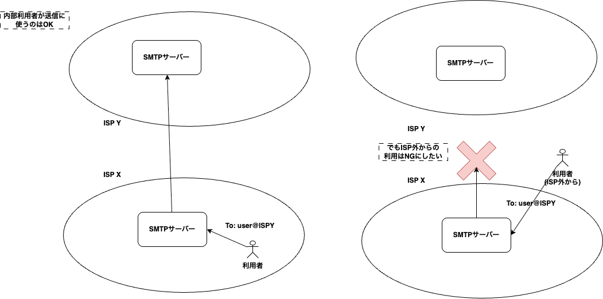
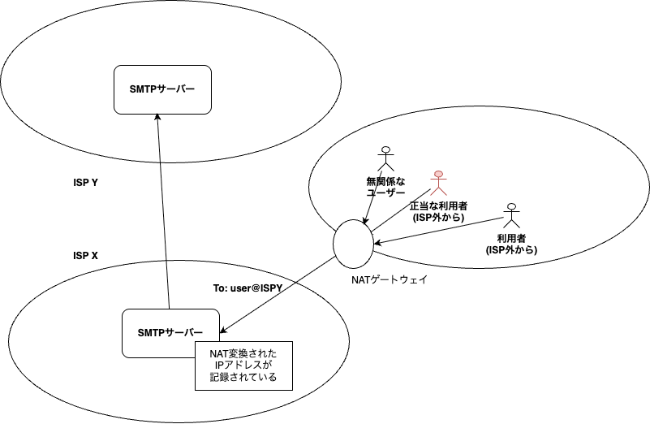

# その他 落穂拾い

メール周りでの補足をいくつか行っておきます。

## IMAP(IMAP4)

メールの取得にはPOP3以外にIMAPというプロトコルもあります。
IMAPはPOP3同様にメールの取得を行うものですが、以下の点が異なります(主用な違いのみ)。

- メールボックスに対するメールはサーバー上に保存されたままにします(削除も可能)。
- メールボックスに対するフォルダー(仮想的なグループ)が生成できるようになっており、サーバー上で分類が可能です。
- 並列操作(メールの取得を複数同時に行うなど)が可能です。
- MIMEマルチパートの一部取得が可能です。

これは、MUAがサーバー上のメールを直接操作することに近いです。
そのため、複数のデバイスをまたがってメールを利用することができます。
例えば会社にいるときはデスクトップにて作業を行い、移動中にスマートフォンで確認するなども可能です。
企業としては、メールという資産をサーバー上で集約/集中された状態で管理できるのも都合がいいでしょう。

POP3と比較して複雑さが増すため、IMAPのサポートはPOP3に比べると出遅れた感じです。
それでも現在の主要なMUAはIMAPをサポートしています。

## APOP(Authenticated Post Office Protocol)

APOPは、POP3の認証を強化する目的で追加されたものです。
APOPは、パスワードを平文で送信するのではなく、チャレンジレスポンス方式を用いて認証を行います。
これにより、パスワードが盗聴されるリスクを軽減します。

しかし、あくまでAPOPはPOP3の拡張にすぎず、認証含めて全てが平文で行われています。
無いよりはマシですが、些細なものだと考えられます。

## POP3S/IMAP4S

POP3(APOP)をTLS/SSLで暗号化したものがPOP3Sです。
POP3Sは、通常 995/TCP で動作します。
SMTPのSMTPSと同様に、最初からTLSで接続を確立します。

同様にIMAP4をTLS/SSL対応したものがIMAP4Sです。
IMAP4Sは、通常 993/TCP で動作します。

## メールの『転送』はどこで可否されるか?

メールの転送(リレー)は、主に2つの状況で発生します。

- MUAからMSA(MTA)に送信する(メールを書いた人が設定したMSAに送信する)
- MTAから別のMTAへ転送する

前者の場合、『どこから』メールが送信されてきたのかということが問題となることがあります。
一般的に、ISP(プロバイダー)に接続している利用者(ユーザー)は、サービスとしてSMTPサーバーへの接続を受けることができます(メールの送信が可能)。
しかし、他のISPから接続しようとした場合は拒否となります。これは、外部からの利用は『サービスの不正利用』とみなされるためです。



MTAから別のMTAへの転送については、原則として以下のルールに則っている限りは問題が発生することはありません。

- MXレコードで送り先が指定されている(example.comのMXがsmtp.example.comであるなど)。
- 送り先MTAが受け入れ可能なドメインとして自サーバーを認識している(smtp.example.com上のSMTPサーバーが受け入れドメインとしてexample.comを認識しているなど)。

そのため、ISPの利用者が何らかの理由で自ISPの外から(MUAの設定を変えずに)メールを送信しようとすると拒否されてしまうことがあります。

## POP before SMTP ※現代では使いません

そこで考案されたのがPOP before SMTPです。
POP before SMTPは、SMTP AUTHが普及する前に用いられた認証方法です。
POP3での認証が成功した後、一定時間内にSMTPでの送信を許可するという仕組みです。
これにより、SMTP AUTHがサポートされていないクライアントでも、POP3での認証を利用してメール送信が可能となります。
しかし、セキュリティ上の問題や利便性の低さから、現在ではほとんど使用されていません。

例えば、以下のように単純にメールを送ろうとすると、失敗することがあります。
```{mermaid}
sequenceDiagram
	autonumber
	participant Client as クライアント(MUA)
	participant Relay as 中継SMTPサーバー(MTA)

	Note over Client,Relay: 25/TCP のSMTP(認証なし)へ直接接続
	Client->>Relay: TCP接続確立
	Relay-->>Client: 220 relay.example.net ESMTP ready

	Note over Client,Relay: POP before SMTPを実施せずに転送を試行
	Client->>Relay: EHLO client.example.com
	Relay-->>Client: 250 relay.example.net
	Client->>Relay: MAIL FROM:&lt;user@example.com&gt;
	Relay-->>Client: 250 Sender ok
	Client->>Relay: RCPT TO:&lt;friend@example.org&gt;
	Relay-->>Client: 550 5.7.1 Relaying denied (authentication required)

	Note over Client,Relay: 認証が無いため配送は拒否される
	Client->>Relay: QUIT
	Relay-->>Client: 221 Bye
```

そこで、一度POP3による認証を行い『認証したIPアドレス』からのSMTP送信目的の接続を一時的に許可するという発想がとられました。

```{mermaid}
sequenceDiagram
    autonumber
    participant Client as クライアント(MUA)
    participant POP3 as POP3サーバー
    participant Relay as 中継SMTPサーバー(MTA)
    participant DB as 認証情報データベース

    Note over Client,POP3: POP3で認証を行う
    Client->>POP3: TCP接続確立(110/tcp)
    POP3-->>Client: +OK POP3 server ready
    Client->>POP3: USER user
    POP3-->>Client: +OK
    Client->>POP3: PASS password
    POP3-->>Client: +OK Logged in.
    POP3->>DB: 認証成功情報を保存(IPアドレス、タイムスタンプ)
    Client->>POP3: QUIT
    POP3-->>Client: +OK Bye

    Note over Client,Relay: 認証成功後、一定時間内にSMTPでの送信を試行
    Client->>Relay: TCP接続確立(25/tcp)
    Relay-->>DB: 認証情報を確認(IPアドレス、タイムスタンプ)
    DB-->>Relay: 認証成功
    Relay-->>Client: 220 relay.example.net ESMTP ready
    Client->>Relay: EHLO client.example.com
    Relay-->>Client: 250 relay.example.net
    Client->>Relay: MAIL FROM:&lt;

```
ポイントは7番のPOP3のところで、もともとメールを受信する行為は『普通に認証を行っている』『受信できるなら正当な利用者』であるという前提に立っていて、その記録をDBに保存するところにあります。
これにより、SMTP側がDBをチェックする機能を追加することで『正当な利用者』を確認できるようにしようとしたアプローチです。
しかしこの問題はセキュリティ上のリスク(関係外のユーザーが一時的にSMTPサーバーを送信目的で使用できてしまう)があったため、非常に危険なものと扱われていました。
現在ではSMTP AUTHが普及したこともあり、 **ほとんど使われていません**。

```{note}
セキュリティ上の問題とはなんでしょうか。
実はこの問題はNAT環境で特に顕著に現れる仕組みです。
POP before SMTPは **IPアドレス**をキーとした一時許可制度とみなすことができます。
ところがNAT配下のクライアントからPOP3アクセスが発生した場合、同じNAT下にいるクライアントは全て同一アドレスからのアクセスとみなされてしまうのです。


```

## SMTP Auth

SMTP Authは、SMTPでの認証を行うための拡張です(ESMTP)。
SMTP Authは、MUAがMSAにメールを送信する際に、ユーザー認証を行うための仕組み(`AUTH`コマンド)を提供します。
これにより、正当な利用者のみがメール送信を行えるようになります。
