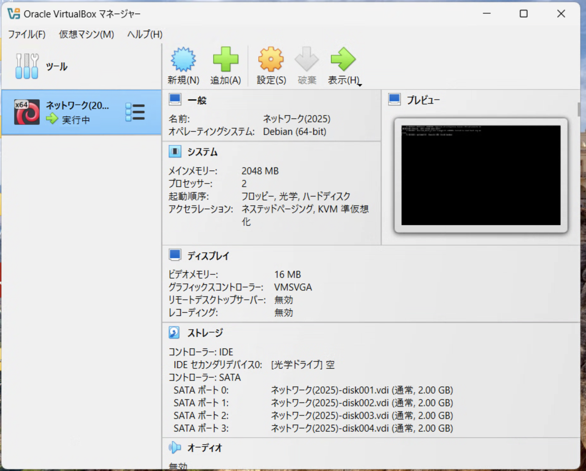
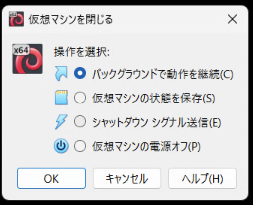

# Linux環境の起動

```{warn}
この作業は、授業開始時に毎回行う必要があります。
```

## 起動方法

Linuxの起動自体は、VMのインポートが完了していれば難しい事はありません。

1. VirtualBoxを起動します
2. 授業用のLinux仮想マシンを選択し{menuselection}`起動`を押します



これだけです。

## 画面表示について

仮想マシンは遠隔地にあるホスト(コンピュータ)であると想定しております。そのため当然ですが画面というものは存在しません。
よって今回の仮想マシンは、コンソールが通常は表示されません。

初回起動時に不安な方は、{menuselection}`表示` というボタンを押せば起動中の様子を見ることはできます。
ただし、稼働していることが確認できたらウィンドウは閉じておいてください。
閉じる際のダイアログでは {menuselection}`バックグラインドで動作を継続` を選択してください。



マシンの性能にもよりますが、初回は1分程度、以降は30秒程度待てば起動は完了しています。

