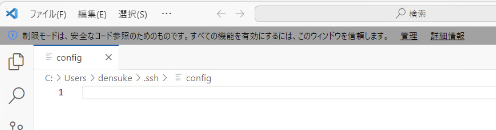
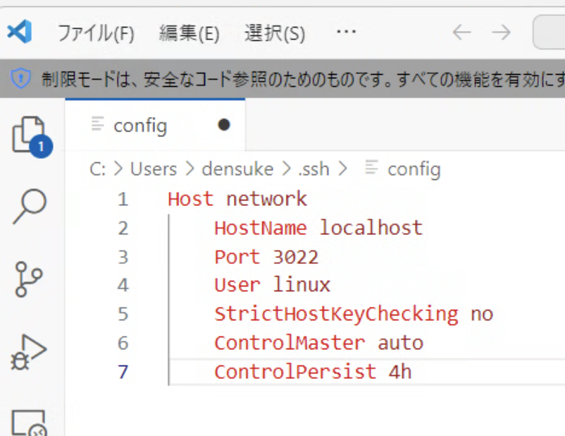

# リモート接続設定

```{note}
この作業は一度行えば繰り返し行う必要はありません。
```


つづいて、リモート接続の設定を行います。
VS codeをインストールしていると、ターミナルで `code` コマンドが使えるようになります。
これを使って、設定ファイルを作成します。

```{note}
以降、 `PS>` はPowerShellのプロンプトと仮定します。
また、シャープ(`#`)以降はコメントですので、明示されていない限り入力対象外です。
```

```pwsh
# ユーザーのホーム上に .ssh ディレクトリを作る
# 既に存在しているとエラーになりますのでその場合は無視してOK
PS> mkdir $HOME/.ssh
PS> code $HOME/.ssh/config
```

これでVS codeが起動し、 `$HOME/.ssh/config` ファイルが開きます。
なんらかの都合で作成済みであれば、中身が出力されます。新規であれば空っぽの状態です。



このファイルの末尾に、以下のコードを挿入してください(コピペ推奨)。

```{code-block}
:caption:  $HOME/.ssh/config に挿入する内容

Host network
  HostName localhost
  Port 3022
  User linux
  StrictHostKeyChecking no
  ControlMaster auto
  ControlPersist 4h
```



挿入完了したら、保存({kbd}`Ctrl+S`)しておいてください。

