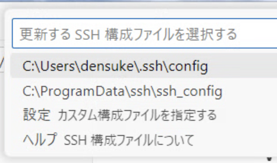
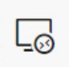
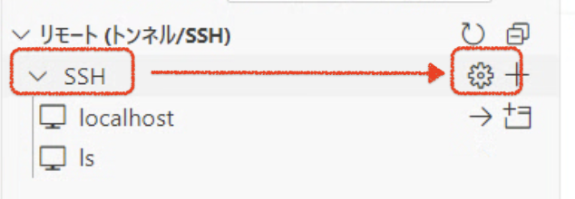
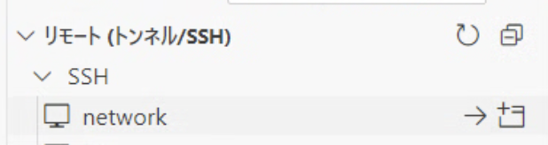
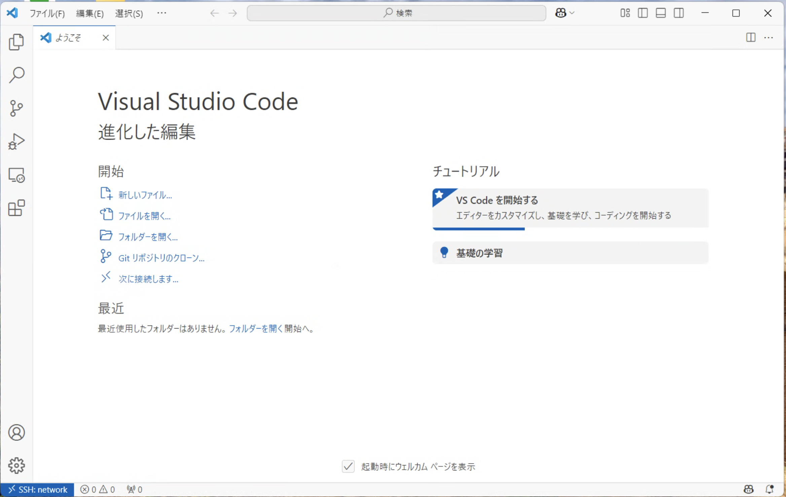
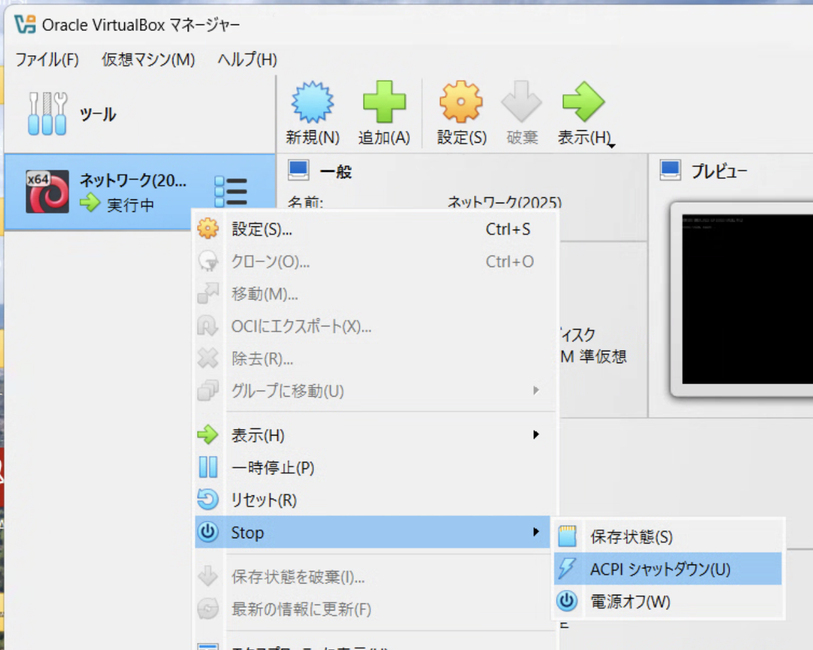

# vscodeからの接続

続いて、vscodeから(起動した)仮想マシンに接続します。
初回は少し難しいと思いますが、一回設定を作ると、次回からは比較的スムーズに接続できるので、落ち着いて作業してみてください。

## 設定の作成

1. コマンドパレットを開きます
2. `remote`と入力すると、
   `Remote-SSH: Connect to Host...` という項目が出てきますので、これを選択します
3. `+ 新規SSHホストを追加する` を選択します
4. 入力欄に、後述のコマンドラインを入力します(コピペOK)
5. 設定の保存先が出ますので、 `C:¥Users¥<ユーザ名>¥.ssh¥config` を選択します
  - 

以下がコピペするコマンドラインとなっています。

```{code-block}
:language: bash

ssh -p 3022 linux@127.0.0.1
```

## 設定の編集

続いて、今作成した設定に少し手を加えます。

1. リモート接続のパネルをクリックします
   - 
2. リモート接続の一覧が出ますので、"SSH"の部分にカーソルを持っていくと設定用の歯車ボタンが出てきます、これをクリックします
   - 
3. 編集対象の確認が出るので、
   `C:¥Users¥<ユーザ名>¥.ssh¥config` を選択します

これで設定ファイルが開きます。

```{code-block}
Host localhost
  HostName localhost
  Port 3022
  User linux
```

これを書き換えます、以下のようにしてください(コピペで置き換えOK)。書き換え後、保存を忘れずに行ってください({kbd}`Ctrl-S`)。

```{code-block}
Host network
  HostName localhost
  Port 3022
  User linux
  StrictHostKeyChecking no
  ControlMaster auto
  ControlPersist 4h
```

```{note}
上記の設定は、それぞれ大雑把に以下の意味を持ちます。

- `Host network`: 接続先(リストに出る名前)
- `HostName localhost`: 接続先のホスト名
- `Port 3022`: 接続先のポート番号
- `User linux`: 接続先のユーザ名
- `StrictHostKeyChecking no`: ホストキーの確認をしない
- `ControlMaster auto`: マルチコネクションの有効化
- `ControlPersist 4h`: マルチコネクションの有効時間
```

## 接続する

では、接続してみましょう。

1. リモート接続パネルをクリックします
2. `network`を選択します(見えない場合はリロードボタンを確認して押してみてください)
   - 
3. このとき右側に2つボタン(アイコン)が出ます、とりあえず{menuselection}`->`(現在のウィンドウで接続)をクリックします
4. 画面が書き換えられ、接続がはじまりました。初回接続先のホスト種別が出るので、Linuxをえらんでください
   - [リモートホスト種別(Linuxを選択)](images/select-remotehost.png)
5. パスワードを聞かれます、文字は出ませんが `penguin` と入れてください
   - [パスワード入力](images/remote-password.png)

接続に成功すると、リモート制御用のツールのダウンロードと準備が行われます。


その後、準備が完了すると、普通のvscodeのような画面に戻ります。
ただし左下に青くリモート接続中であることがわかるように追加がされています。



接続が確認できれば今はここまでで大丈夫です。
続いて終了(閉じ方)も確認しておきましょう。

## 接続の閉じ方

vscode側は、未保存がなければ気にせず閉じて大丈夫です。

VirtualBoxは、マネージャー画面に出ているマシン名を右クリックし、 {menuselection}`Stop --> ACPIシャットダウン` としてください。



少し待つと終了します(確認が出た場合はシャットダウンを選べばよい)。
しばらくすると **電源オフ** になります(10秒〜30秒程度)。

```{warning}
きちんと終了せずに放置すると、以下の弊害が生じます。

- 仮想マシン分だけリソースを消費しっぱなしになります
- 気づかずWindowsを終了した場合、異常終了となり、最悪仮想マシンが壊れます
  - 未提出の課題があった場合アクセスできなくなることもあります
```

## 次回以降は…

次回以降は、以下の手順で動かすことになります。

1. VirtualBoxのマネージャーからVMを起動し、30秒程度待つ
2. vscodeのリモート接続から『ネットワーク』を選ぶ
   - 他に起動していなかった場合、vscodeが起動直後に接続を再開しようとします
3. パスワードを聞かれたら再度 `penguin` と入れる
   ※ 早すぎると接続に失敗することがあります

授業終了後にvscodeを閉じての仮想マシンの終了処理を行うようにしてください。
