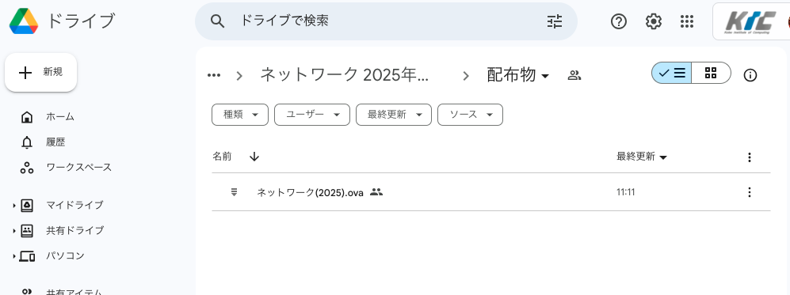
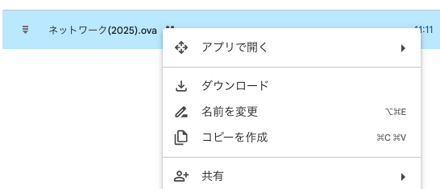
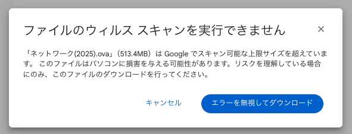

# 仮想マシンイメージのダウンロード

次に仮想マシンのイメージをインポートするため、ダウンロードを行います。
イメージはGoogle Classroom上で公開しています。

1. Google Classroom上のコースにアクセスします。
2. 「授業」タブにある「配布物」をクリックします。
3. Googleドライブの画面に切り替わり、ファイル一覧が表示されます。
   
4. OVAファイル({file}`ネットワーク(2025).ova`)が表示されているので、名前の部分を右クリック(もしくは右の3点ボタン)から {menuselection}`ダウンロード` を選択します。
   
   
5. ファイルサイズが大きいため **ファイルのウィルススキャンを実行できません** と出ますが、そのまま {menuselection}`エラーを無視してダウンロード` をクリックします。
   

これでダウンロードが実行されるので、終了するまでしばらく待ってください。

