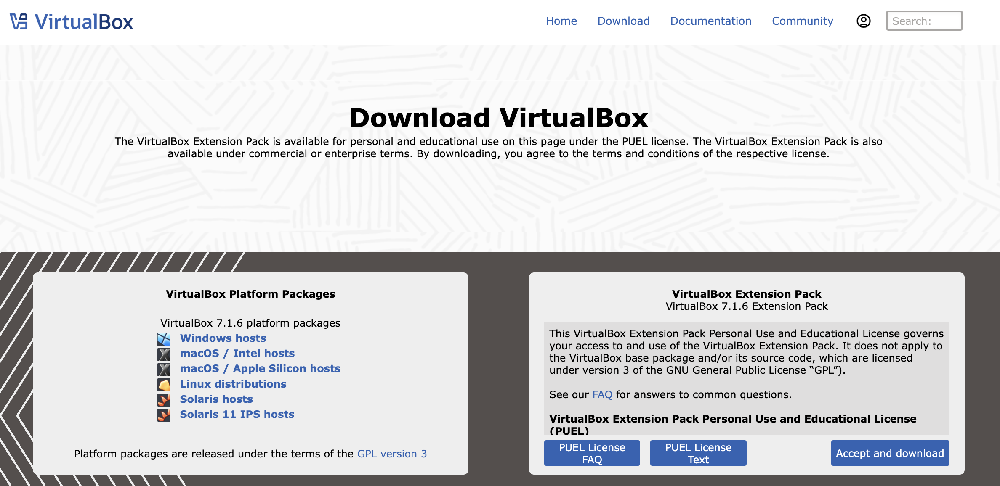

# VirtualBoxのインストール(更新)

VirtualBoxがインストールされている場合、起動すると更新の確認が時々行われることがあります。
しかし、更新があったとしても自動更新が起きるわけでもありません。
そのため最新版のインストーラーをダウンロードしてインストールしましょう。
更新となる場合は、自動的に置き換えとなります。

## インストーラーの入手

インストーラーは以下の場所から入手できます。

- [VirtualBoxのダウンロードページ](https://www.virtualbox.org/wiki/Downloads)
    - [VirtualBoxのリリースノート](https://www.virtualbox.org/wiki/Changelog)
    - 利用しているOSにあわせてダウンロード(Windows上で使うならWindows host版をダウンロード)

ダウンロードしたファイルの名前は、**VirtualBox-バージョン番号-ビルド番号-OS種別**に各OSの実行形式などの拡張子となっています(Windowsであれば`.exe`)。

