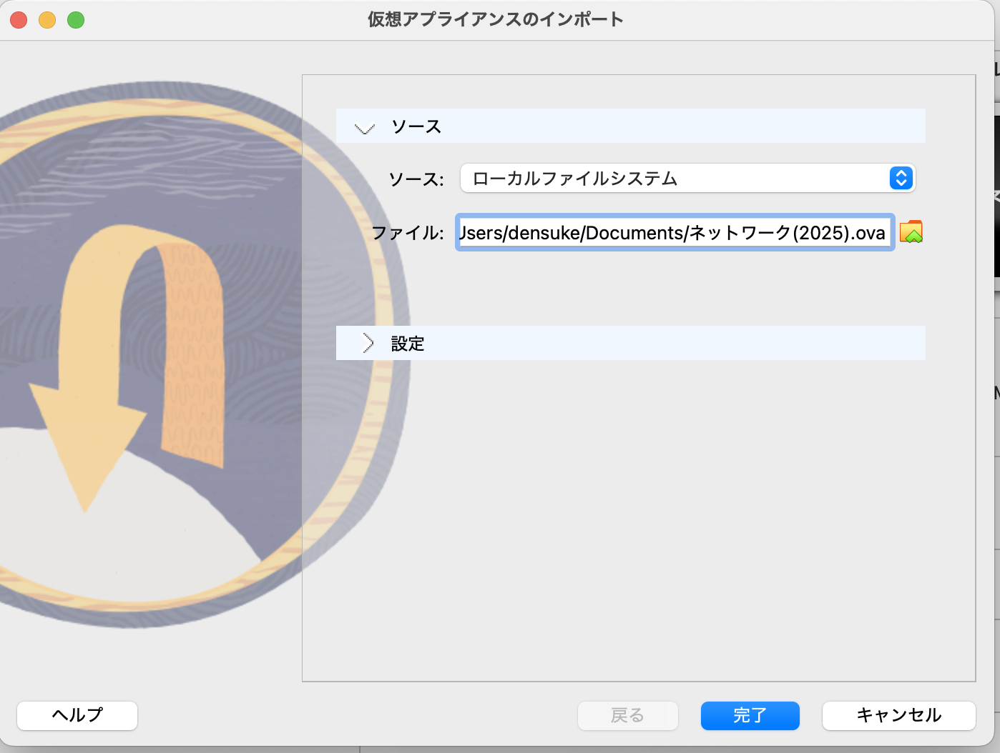
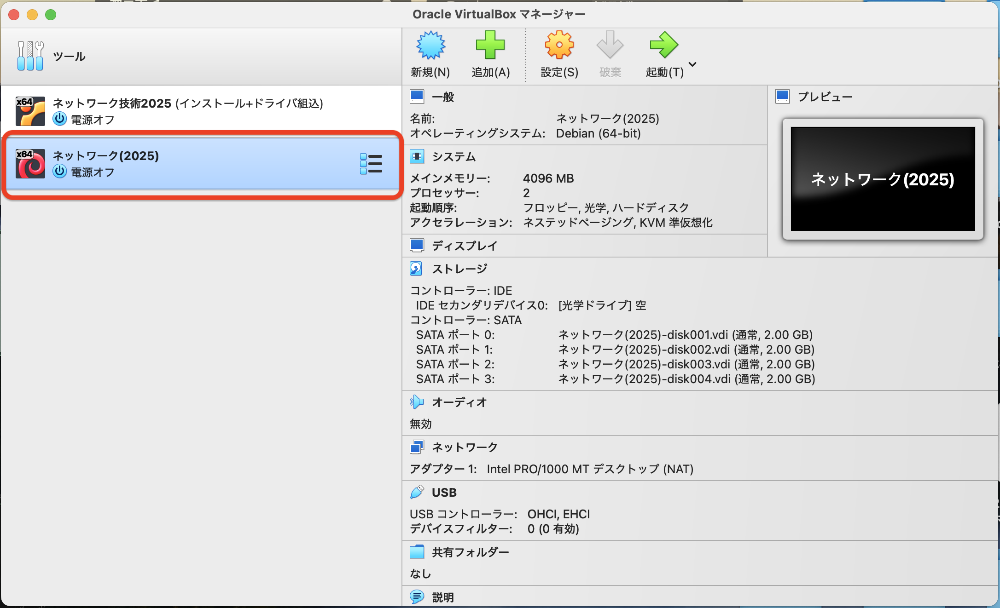
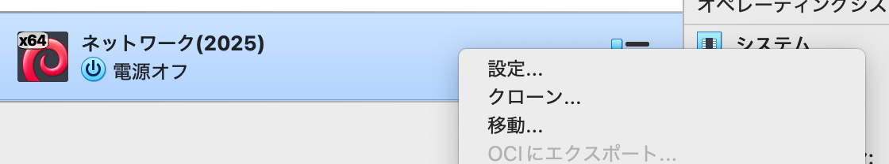
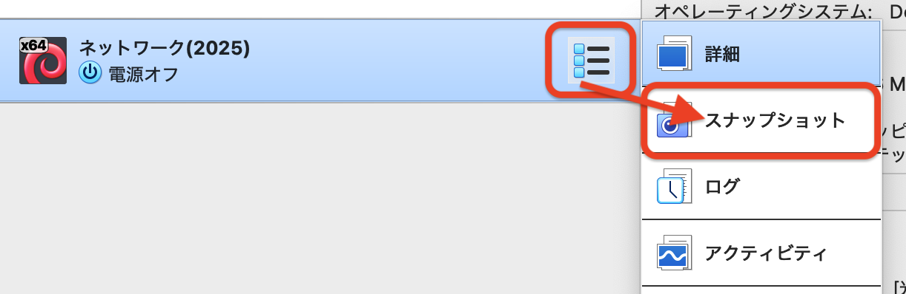
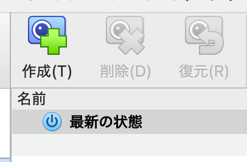
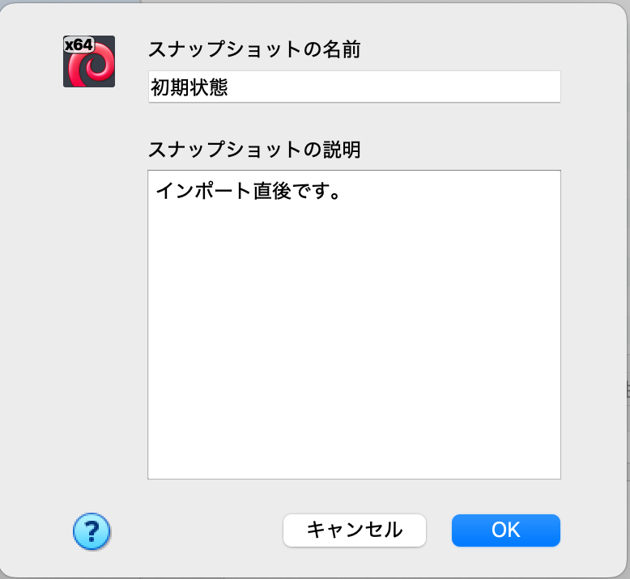
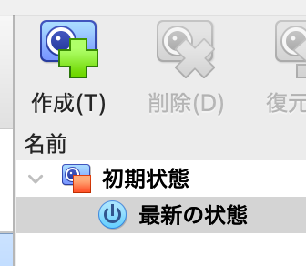
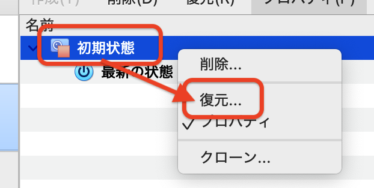
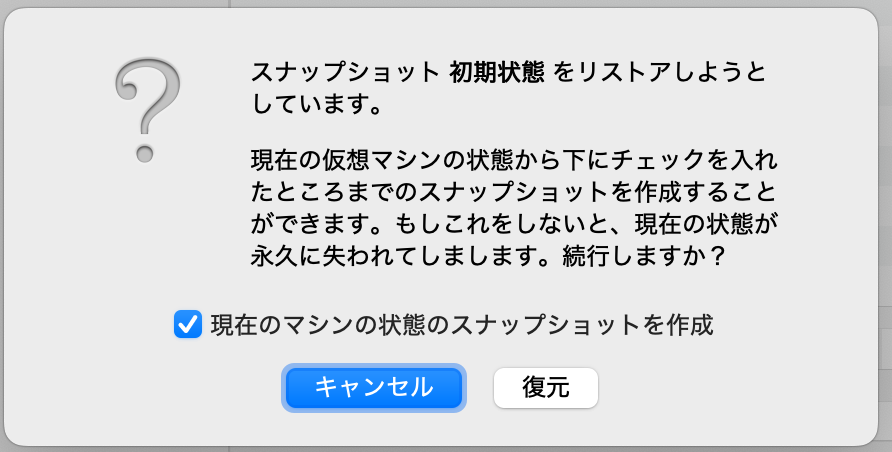

# イメージのインポート

ダウンロードが完了したら、イメージのインポートでVMを構築します。

## インポートの流れ

1. VirtualBoxを起動します。
2. メニューから {menuselection}`ファイル` → {menuselection}`仮想アプライアンスのインポート` を選択します。
3. インポートするイメージとして、ダウンロードしたファイル({file}`ネットワーク(2025).ova`)を選択します。
   
4. {menuselection}`完了`をクリックします。

以上でインポート処理が進み、少しするとメイン画面に仮想マシンが追加されます。

仮想マシンの名前は「ネットワーク(2025)」となっています。

## オプション: 仮想マシンの設定変更

仮想マシンは初期設定でリソース利用設定を以下の形に設定しています。

- CPU数 2コア
- メモリ 4GB(4096MB)

もしPCの性能に余裕がないと思われる場合は、設定を変更しておいてください

1. VM名「ネットワーク(2025)」を選択し、右クリックでメニューから {menuselection}`設定` を選択します。
   
2. 「システム」カテゴリにある以下の場所を適当に調整してください。
    - 「マザーボード」タブ
      - メモリサイズを調整できます、実メモリの25%程度(ただし2GB以上にはしておくこと)でおそらく大丈夫です。
    - 「プロセッサー」タブ
      - CPU数を調整できます、実CPUの半分程度(最低2コア)でおそらく大丈夫です。
      - CPU利用率も調整できます、こちらは100%のままで大丈夫です。

調整したら、 {menuselection}`OK` をクリックして設定を保存します。

## オプション: スナップショット

仮想マシンの面白い機能として「スナップショット」があります。
この機能は、仮想マシンの現在の状態を保存でき、必要に応じて「復元」できるというものです(ゲームでいうところのセーブポイントでしょうか)。
怪しい操作をしたときに迅速に戻せるよう、スナップショットを作っておくことは正しい選択と考えられます。

1. VM名「ネットワーク(2025)」を選択し、横にある3点ボタンを左クリックし {menuselection}`スナップショット` を選択します。
   - 
2. 初期状態では「最新の状態」という名前が出ているので、上にある {menuselection}`作成` をクリックします。
   - 
3. スナップショットの名前を入力します、日時情報などは不要です。例えば「初期状態」でいいでしょう。
   入力後、 {menuselection}`OK` をクリックします。
   - 
4. スナップショットが作成され、「最新の状態」がぶら下がった状態になります。
   - 

再び3点ボタンから{menuselection}`詳細`に戻せば元の画面に戻ります。

何かあった時の「復元」は、スナップショットのメニューから行います。

1. 戻したい状態(例えば「初期状態」)を選択し、右クリックで {menuselection}`復元` を選択します。
   - 
2. 復元の確認が出るので、確認して進めます。
   - 「現在のマシンの状態のスナップショットを作成」のチェックを外しておいてください。
     - チェックを付けていると現状に対するスナップショットの名前が求められます。
   - {menuselection}`復元` をクリックします。
      - 

これで指定した状態に戻ります。
