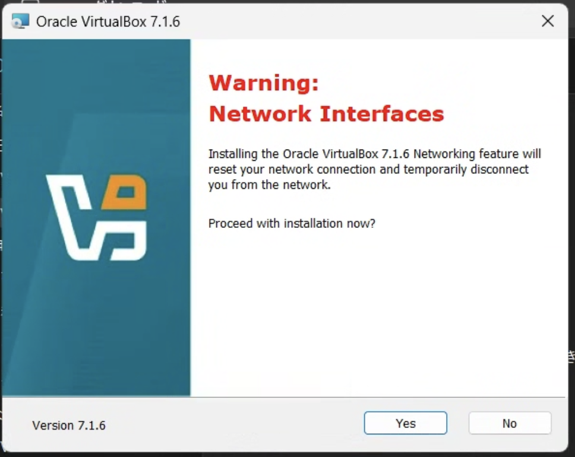

# インストール(更新)

以下の説明では、Windows host版をベースに説明します。
といっても基本の流れはよくあるインストーラーの流れと同じです。

インストーラーを起動すると、以下の画面からスタートします。

そのまま {menuselection}`Next` をクリックします。

ライセンスの確認が出るので、了承(`I accept...`)をチェックして、 {menuselection}`Next` をクリックします。

インストール先の選択画面が出ます。
特に変更がなければそのまま {menuselection}`Next` をクリックします。

インストール中にネットワークが一時的に切れることがあるのでその注意喚起です。
{menuselection}`Next` をクリックします。

Pythonのインストールとwin32apiモジュールについての注意喚起がでることがあります。
「必要なら後でインストールを行ってください」とありますがこの授業では使いませんので、そのまま {menuselection}`Next` をクリックします。

各種オプション項目の選択画面が出ます。
特に変更がなければそのまま {menuselection}`Next` をクリックします。

インストール開始前の確認画面です、そのまま {menuselection}`Next` をクリックします。

インストールが完了しました。デフォルトで「この後VirtualBoxを起動する」のチェックが入っている状態です(そのままにしておく)。
{menuselection}`Finish` をクリックしてインストーラーを終了します。

インストールが完了すると、VirtualBoxが起動します。

## おまけ: 更新確認

VirtualBoxを既にインストールしている場合、定期的に更新の確認が行われています。メニューからでも更新確認ができます。
更新がある場合、ダウンロード先のリンクが出ます。

指示に従ってダウンロードして、VirtualBoxを終了させてからインストールを行ってください。
更新として処理が進みます。
