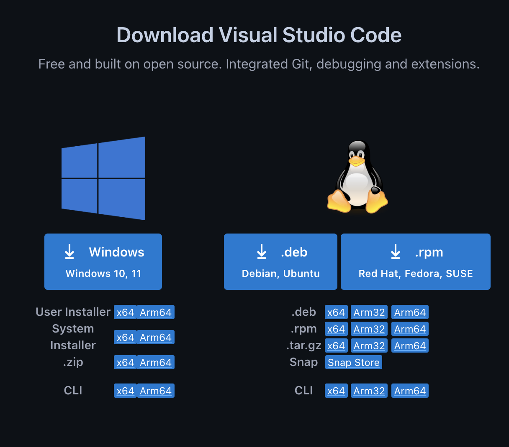
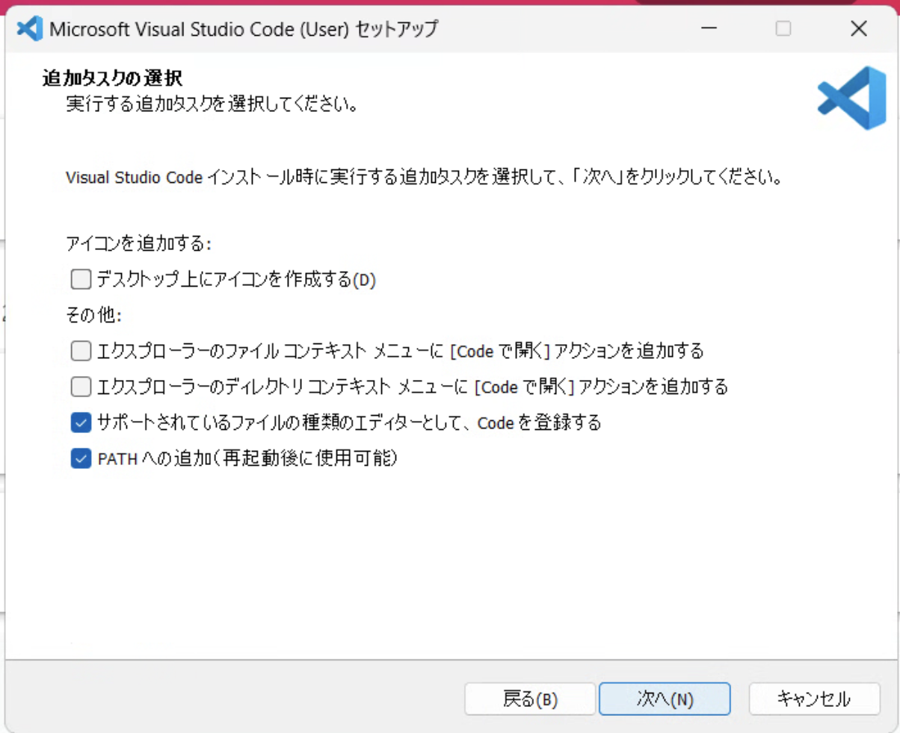

# インストール

特に複雑なものはありません。

## vscodeのダウンロード

[https://code.visualstudio.com/Download](https://code.visualstudio.com/Download)からダウンロードします。

※ macOS版の方もこのページからダウンロードできます。

Windowsを使っている方は、Windows(x86_64)のインストーラーをダウンロードします。細かい選択肢もありますが、単純に {menuselection}`Windows10, 11` を選択すればインストーラーがダウンロードされます。

## インストール

ダウンロードしたインストーラーをクリックし、指示に従ってすすめてください。特に難しい項目はないので画面は特に添付しません。

## オプション: インストール時の選択肢

インストールの途中で、以下の確認がでることがあります。

- デスクトップ上にアイコンを作るかは趣味に任せます
- ファイル・ディレクトリに対するコンテキストメニュー(右クリック)に含めるかも趣味に任せます
- `PATH`に追加するかは、コマンドラインからvscodeを起動したい場合はチェックを入れます
  - 普通コマンドライン(ターミナル)を使うはずなので、チェックが入っているとすごく助かるかと思います
  - 次の起動時(もしくはログイン時)に有効となります

