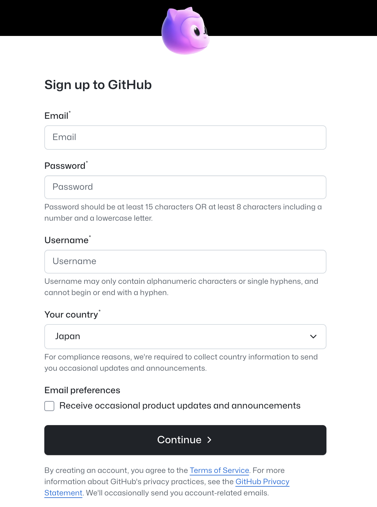
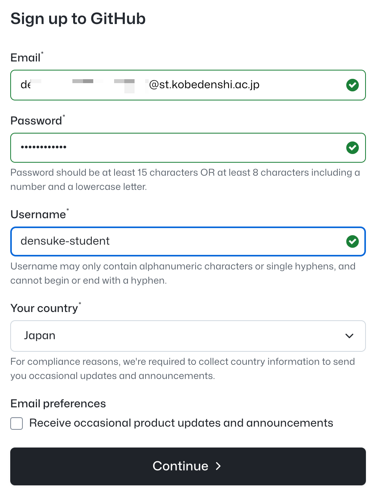
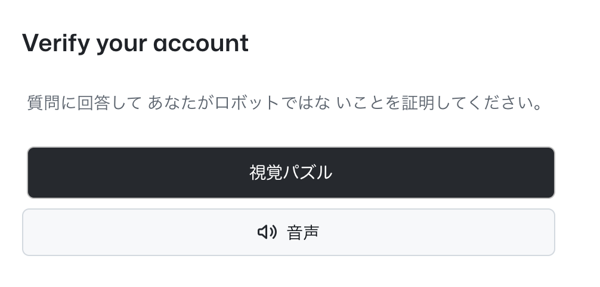
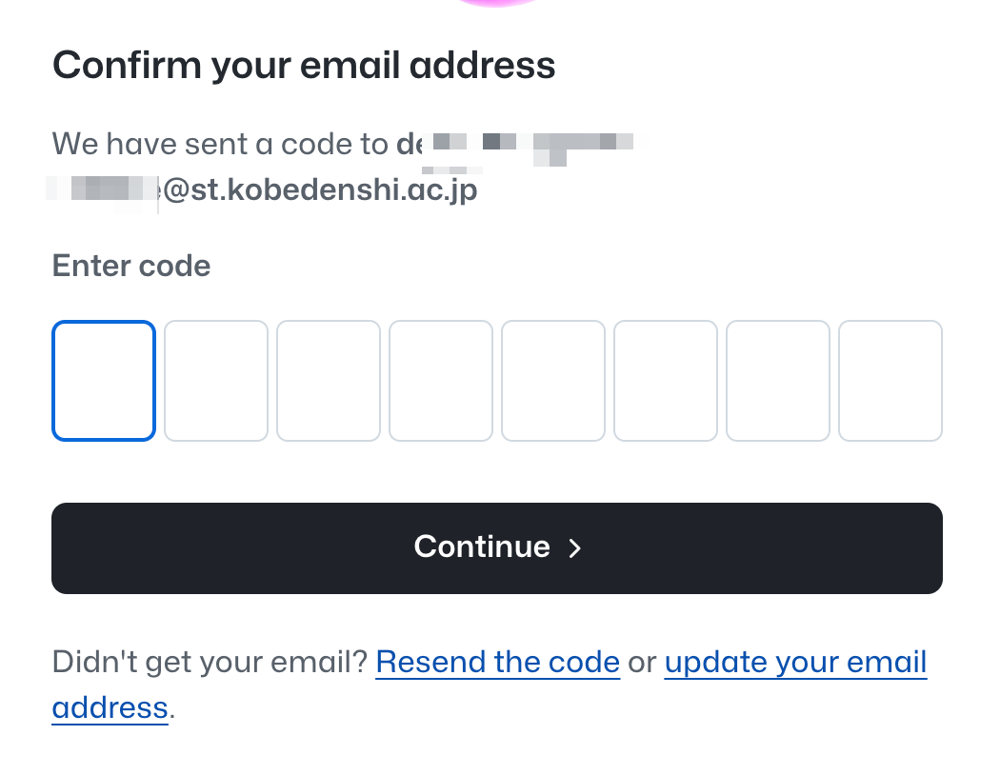
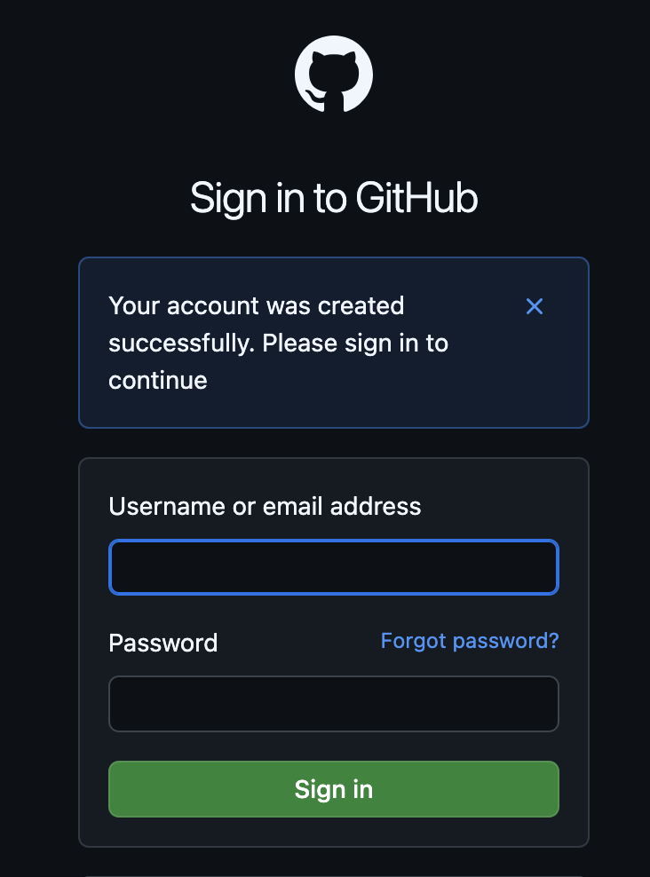
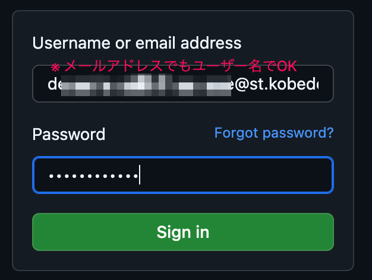

# GitHubアカウントの作成

```{note}
既にGitHubアカウントを持っている場合はスキップ可能です。
次に進んでください。
```

```{warning}
ブラウザの自動翻訳機能は無効化してください。
技術職の業務において、最初から機械翻訳を読むよりも、きちんと英語で見る習慣を付けてください。
```

それでは、GitHubアカウントを作成しましょう。

## GitHubにアクセスする

- [GitHub](https://github.com/)


中央にある緑色の {menuselection}`Sign up for GitHub` をクリックします。
次の画面で、必要事項を入力していきます。

## サインアップする



- Email: メールアドレス、初めて作るなら学校のアドレスを強く推奨します(`kd〜@st.kobedenshi.ac.jp`)
- Password: パスワード、8文字以上の英数字を含むものを設定してください ※忘れないようにしてくださいね
- Username: ユーザー名、半角英数字で設定してください
    - 既に使われているものは拒否されます
- Your Country: 国、Japanを選択してください(多分自動で選ばれてます)
- Email preferences: メールの受信設定、特に必要なければそのままでOKです

ひととおり入力が完了すれば、 {menuselection}`Continue >`をクリックして作成します。



## 認証を通す

次に進むと、ボットアクセスでは無いことの確認が出ます。



その後、メールに届いた番号を入力するよう求められます。



メールをチェックし、届いたコード(数値)を入力します。


これで完了です。

## ログインする

メール認証が完了すると、ログインスクリーンとなります。



ここに、作成したユーザー名(メールアドレスでもOK)とパスワードを入力します。



ブラウザによるアカウントの保存はお任せします。
ログインできればアカウントの作成は完了となります。

