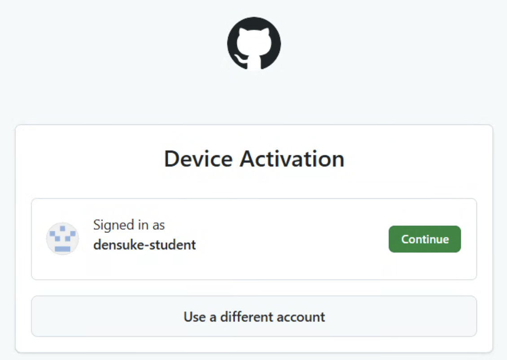
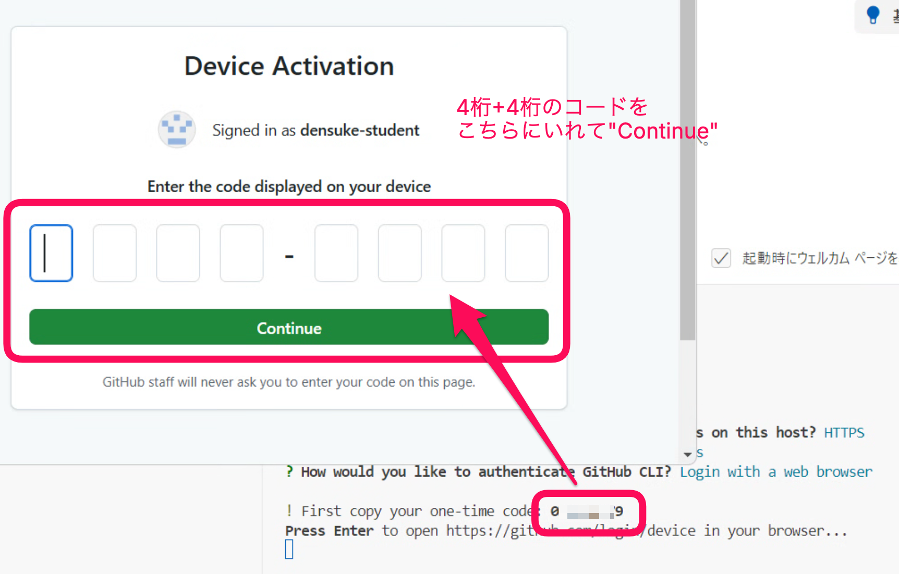
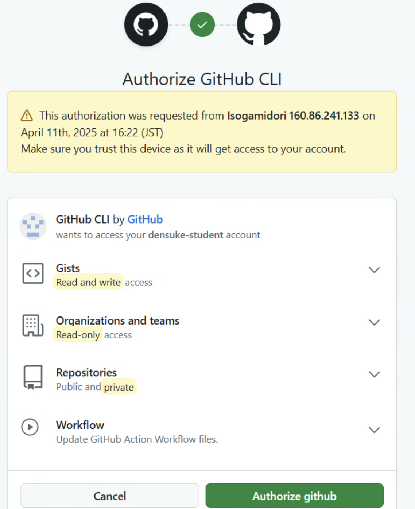

# GitHubアカウントの登録

GitHubのアカウントが作成できたので、これをLinux環境で使えるようにセットアップしていきます。

## gh-cliのインストール

gh-cli(`gh`コマンド)は今回配布の環境では導入済みです。
バージョン情報が表示されればインストールされていることが確認できます。

```bash
$ gh --version
gh version 2.39.0 (2023-10-02)  # あくまで例です。
```

## gh-cliのセットアップ

つづいて、gh-cliのセットアップを行います。
gh-cliはGitHubのアカウントと連携する必要があります。

同じくターミナルを使って行います。選択肢はカーソルキーで選べますが、ほぼ初期値のままEnterで進められます。

```bash
$ gh auth login
```

1. `Where do you use GitHub?` -> `GitHub.com`
2.  `Where do you use GitHub?` -> `HTTPS`
3. `Authenticate Git with GitHub credentials?`はそのままEnterを押す(`Y`の扱い)
4. `How would you like to authenticate GitHub CLI?` -> `Login with a web browser`

すると、`First copy your one-time code: XXXX-YYYY` とコードが表示されます(この後使います)。
さらにEnterキーを押すことで、ブラウザが起動してログインページに遷移します。
ログインを要求されたら、先に作ったアカウントでログインします。

使用するアカウントの確認が出るので、選択します。



次に、先程出たコード8桁(`XXXX-YYYY`)を入力します。



承認するかの確認が出るので、{menuselection}`Authorize`を選びます。



これで、 **Congratulations, you're all set!** と表示されれば完了です。
vscodeのターミナルに戻ると、プロンプトに戻っています。

```bash
✓ Authentication complete.
- gh config set -h github.com git_protocol https
✓ Configured git protocol
! Authentication credentials saved in plain text
✓ Logged in as densuke-student
$ 
```

これで完了です。

