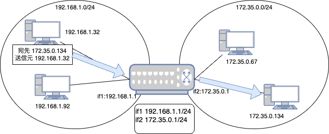

# ルーティング(経路制御)

ルーティングは、ネットワーク上のパケットが、目的地となるアドレスへ適切に転送されるように経路を決定していくプロセスです。
データリンク(レイヤー2)では『同一のネットワーク』の中しか送受信できませんでしたが、この機能により『異なるネットワーク』間でもパケットを転送できるようになります。

## IPアドレスと経路制御について

IPアドレスとネットマスクを組み合わせることで、属しているネットワークを特定できます。
そのため、各ホスト(ノード)は以下の方法でパケットを転送します。

- 自分のネットワークに属しているホストへの転送
    - データリンク層(イーサネット)の仕組みを使ってMACアドレスレベルで直接届けることができます
- 自分のネットワークに**属していない**ホストへの転送
    - IP層でのルーティングを行い、目的のネットワークにパケットを転送します
    - このためには、経路制御表(ルーティングテーブル)を参照し、送り先(転送先)を決める必要があります

## 経路制御表(ルーティングテーブル)

経路制御表(ルーティングテーブル; routing-table)は、IP層でのルーティングを行うために必要な情報を保持しているデータベースです。
このテーブル(データベース)は、各ホスト(ノード)上に存在しています。
起動時にカーネル上のメモリ上に構築されます。

- 起動時にネットワークを構成したときにルーティングテーブルに追加されます
- 静的エントリー(ファイル)がある場合は、適当なタイミングでルーティングテーブルに追加されます
- DHCP(動的構成)の場合、ネットワークから切り離された時点で該当するエントリーが削除されます

ルーティングテーブルの確認方法は、各OSで様々です。

### Windowsの場合

```powershell
# Windows PowerShell
PS> Get-NetRoute
```


以下は、`Get-NetRoute` コマンドで表示される主なフィールドの説明です。

- **InterfaceIndex** (ifIndex)
    この経路が関連付けられているネットワークインターフェースのインデックス番号
- **DestinationPrefix**  
    宛先ネットワークアドレスとプレフィックス長(例: 192.168.1.0/24)
- **NextHop**  
    パケットを転送する次のルーター(ゲートウェイ)のIPアドレス
- **RouteMetric**  
    経路の優先度を示す値(数値が小さいほど優先される)
- **InterfaceMetric** (ifMetric)  
    ネットワークインターフェースの優先度を示す値(数値が小さいほど優先される)
- **PolicyStore**  
    経路情報が保存されている場所

これらのフィールドを確認することで、どのネットワーク宛てのパケットがどの経路を通るかを把握できます。

大雑把には、以下の方法でパケットの送信先を決定しています。

1. ルーティングテーブルを確認し、宛先IPアドレスに一致するエントリーを探します
    - DestinationPrefixを参照します
    - 書かれているIPアドレスとネットマスクが、送ろうとしているパケットの宛先IPアドレスを含むか確認します
        - 宛先IPアドレスとネットマスクの積を取って確認する
2. 一致するエントリーが見つかった場合、そのエントリーに基づいてパケットを転送します
    - 複数該当した場合は、RouteMetricの値が最小のものをみつけ、その上でifMetricの値が最小のものを選択します
3. 一致するエントリーが見つからなかった場合、デフォルトルート(デフォルトゲートウェイ)を使用します
    - デフォルトルートは、通常、`0.0.0.0/0`となるため、他にマッチしていなければ全てのアドレスがマッチします(あらゆるIPアドレスにネットマスク0(=0.0.0.0)を適用すれば確実に0.0.0.0になる)
    - デフォルトルートが採択された場合、NextHopに指定されたIPアドレスにパケットを転送します

こうして利用すべきレコードをルーティングテーブル上で見つければ、ifIndexを参照して該当するインターフェースに対して **データリンク層を使って** 送信します。
最終的な送り先は、直接的に送信できる範囲であればMACアドレスを使ったデータリンクのレベルでの転送が行われるからです。
デフォルトルートが採択された場合、直接相手のアドレスに送れないため、指定されたアドレス(=NextHopのアドレス)はいわば「中継地点」として扱われます。
この中継地点は、ルーターやゲートウェイと呼ばれるものとなります。

以下に各OSごとのルーティングテーブルの取得方法を示しますが、必要なのは以下のことです。

- 宛先IPアドレスが自分のネットワークの内か外か
- 宛先が決定した後は対象となるホストへのインターフェースを決定できるか


### Linuxの場合

現代のLinuxでは`ip`コマンドを用いて表示させます。

```bash
$ ip route
```


こちらは比較的シンプルな表示になっています。

- `default via` はデフォルトルートを示しています
- `dev` はインターフェース名を示しています

かなり省略されている感じです。そういう意味では旧来の`route`のほうがもう少し詳細に出力されます。

```{note}
`ifconfig`コマンドのために`net-tools`を入れていれば、`/sbin/route`コマンドが使えるようになっています。
```

### macOSの場合

```zsh
% netstat -rn
```


ARP[^arp]で取得したと思われるIPとMACアドレスの対応関係も含まれるため、出力数がすごく多いです。

[^arp]: Address Resolution Protocol、IPアドレスからMACアドレスを調べるためのプロトコルです(後ででる予定)。

## ルーター(ゲートウェイ)

ルーター(router)もしくはゲートウェイ(gateway)は、異なるネットワーク間でパケットを転送するためのデバイスです。
ルーターは、IP層でのルーティングを行い、パケットを目的のネットワークに転送します。

前述の『デフォルトルート(デフォルトゲートウェイ)』は、このルーターを指すことになります。
ルーターはいわばネットワークの『境界線』にあたるもので、隣接するネットワークごとの回線を持つ存在です。



- ルーターは自身の各インターフェースごとに接続しているネットワークの情報を持っています
- ルーターは、各インターフェースからパケットを受信し、宛先IPアドレスに基づいて適切なインターフェースにパケットを転送します

もしネットワーク上に複数のルーターが存在する場合も、それぞれのインターフェースが同じネットワークに存在しているはずなので、ルーターは別のネットワークへ転送する必要があるなら最適と思われるルーターを選択してパケットを転送することになります。

## ルーティングプロトコル

ルーターは別のネットワークへの転送経路を決定するために、隣接するルーターの情報を用いる必要がでることもあります。
このため、ルーター同士が情報を交換するために『ルーティングプロトコル』を用いて対応していることがあります。

状況や規模に応じたプロトコルが存在します。
代表的なものをあげると、以下のようなものが知られています。

- RIP(Routing Information Protocol)
    - 簡単なプロトコルで、主に小規模なネットワークで使用されます
    - ホップ数を基準に経路を選択します
    - 現在はRIP2が主流です
- OSPF(Open Shortest Path First)
    - 大規模なネットワークで使用されるプロトコルです
    - リンク状態ルーティングプロトコルで、各ルーターがネットワークの状態を把握し、最適な経路を計算します
- BGP(Border Gateway Protocol)
    - インターネットのルーティングに使用されるプロトコルです
    - 自律システム間での経路情報を交換するために使用されます
    - 大規模なネットワークやISP間でのルーティングに適しています
    - BGP4+によりIPv6にも対応しています

### 現代的なルーティング技術

2025年現在、従来のルーティングプロトコルに加えて、以下のような新しい技術も注目されています:

- **Segment Routing(SR)**
    - SDN(Software-Defined Networking)の概念を取り入れたルーティング技術
    - パケットヘッダーに経路情報を埋め込むことで、より柔軟な経路制御を実現
    - MPLS-SRとSRv6(IPv6ベース)の2つの実装方式があります

- **BGP Flowspec**
    - BGPを拡張してフロー単位でのトラフィック制御を可能にする技術
    - DDoS攻撃の緩和やトラフィックエンジニアリングに活用されています

- **RPKI(Resource Public Key Infrastructure)**
    - BGPルート広告の正当性を暗号学的に検証するセキュリティ技術
    - ルートハイジャック攻撃の防止に効果的です

- **Machine Learning in Routing**
    - AIを活用したネットワーク最適化技術
    - トラフィックパターンの予測や動的な経路選択に応用されています

```{note}
RIPについては、過去に基本情報で(RIPと書かずに)出していたことがあります。

→ [H.23特別試験 午後 問4](https://www.fe-siken.com/kakomon/23_toku/pm04.html)
```

またルーター上のルーティングテーブルは、情報交換により値が蓄積すると、ルーティングテーブルのエントリーが増えていきます。
増えすぎると、ルーティングの性能が悪化するため、可能であればルーティングテーブルのエントリーを『集約』することで性能を改善されることもあります。

## パケットの分割処理

ルーティングの際、パケットが分割されることがあります。
例えばイーサネット(データリンク)に送るとき、通常フレームのペイロード長は1500バイトまでとなっています[^jumbo]。
そのため、IPパケットが1500バイトを超えてしまうときは、分割して送信する必要があります。

分割の基準となるのは各レイヤーにおけるパケット(フレーム)の大きさであり、これをMTU(Maximum Transmission Unit)と呼びます。
MTUは、各レイヤーにより異なっています。
たとえばIP層のMTUは65535バイトですが、データリンク層のMTUはイーサネットの場合は1500バイトです。

また、本編では扱いませんでしたが、データリンクではイーサネットや無線といったもの以外にいくつかの物理媒体が存在しています。
雑に表にすると、以下のような感じです(あくまで一部)。

| 物理媒体名(プロトコル)     | MTU(バイト)  |
|:----------------------:|:-----------:|
| Ethernet               | 1500        |
| PPP                    | 1500        |
| ATM[^CLIP]             | 9180        |
| ISDN[^ISDN]            | 1500        |
| PPPoE                  | 1492        |
| L2TP                   | 1460        |
| GRE[^GRE]              | 1476        |

> **備考**  
> - ISDNのMTUは実装や利用形態によって異なりますが、一般的な値として1500バイトを記載しています。  
> - IPsec, IPv4, IPv6は物理媒体ではなくプロトコル層のMTUであり、ここでは除外しました(IPsecは暗号化オーバーヘッドにより実効MTUが小さくなる場合があります)。

[^CLIP]: ATMは自体は53オクテット固定(セルという単位)というものなのですが、CLIP(Classical IP and ARP over ATM)というIP伝送向けのプロトコルを使った場合のMTUは、RFC 2225にて9180となっているので記載しています。

[^ISDN]: ISDN自体は回線交換のためパケット交換に基づく転送ではありません。が、IPパケットを流すときにはそのままイーサネット側の1500を流用していることが一般的のようです。

[^GRE]: GREはGeneric Routing Encapsulationの略で、IPパケットをカプセル化して転送するためのプロトコルです。MTUは1476バイトですが、これはGREヘッダー(4バイト)とIPヘッダー(20バイト)を考慮した値です(1500-20-4=1476)。

このため、イーサネットを通過しようとする際に、上位層でより大きなサイズで入ってくると、データリンクに落とし込むときに分割が発生してしまいます。
この処理はデータリンク層において負荷がかかる可能性があるため、なんなら最初から上位層で分割しておくことで負荷を下げることが期待されます。

実際、`tcpdump`などでパケットキャプチャすると、各フレームのサイズは1500より下回っていることが多いです。
以下の図は、Ubuntu Linuxのイメージ配布サイトからダウンロードをしている最中(約3GB)に、`tcpdump`でキャプチャした時の様子ですが、ここでは1402オクテットずつ落ちてきています(1500でないことは、ここでは気にしないでください)。


こういったこともあって、データリンクに落とし込む前の段階で、利用する媒体に応じてパケットのサイズ(MTU)をより適切なものにすることで、分割による負担を軽減させることが期待されています。

## 分割処理とパスMTU探索

前述の通り、分割はパケットやフレームに入れられるサイズに基づいて行われます。
手元とも言えるIPパケットそのものや、イーサネットなどは特に問題なくMTUの検出ができるかもしれませんが、ルーティングによって手元を離れた時のパケット・フレームの分割はもはや『手から離れた』状態のため適切かどうかがわかりません。

もし分割が必要という状況になった場合どうなるのでしょうか?この問題に対応するためにIPパケットでは分割を認めるかどうかという判定ビット(DF; Don't Fragment)が存在しています。
このフラグが立っていない場合(すなわちゼロ)は、分割が可能ということで分割処理が実行されます。

とはいえ、分割処理はルーターなど中継装置への負担が大きいため、可能であれば『最初から最小のMTUにしておけばいいのでは?』という考え方が存在します。
そこで、このような処理を考えてみましょう。

1. 送信元のホストが、適当なサイズに切り出したデータの冒頭を送信します
    - このパケットにはDFビットが立った状態にしておきます(分割禁止)
    - 例えば1500オクテット(イーサネット)など
2. ルーターは、パケットを受け取ったときに、次の経路となるインターフェース上のMTUを確認します
    - MTUが十分に大きいのであればそのまま流します
    - MTUが不足している場合(分割が必要)、DFビットが経っているため分割できないためエラーとなります
        - そのパケット自体は破棄される
        - ICMPというプロトコルにより送信元(ダミーパケットを送った張本人)に対してエラーを通知します。通知内容は以下の通りです。
            - 『MTU超過により送信できませんでした(DFビットにより分割禁止)』
            - 『送信元でMTUを調整して再送してください』
            - 『次の経路のMTUは〜です』
3. 送信元は、受け取ったエラーを元にMTUを調整して再送します

最終的に届いた時のMTUを記憶することで、経路上で分割の発生しない最小値を決定しています。
このロジックを用いて経路に対する最小MTUを決定し、学習していくことを『パスMTU探索(Path MTU Discovery)』と呼びます。
学習は数分間はキャッシュされるため、同じ経路を通る際は再利用されますし、しばらく使われなければ(判定方法はOSにより異なります)キャッシュがクリアされます。
またネットワーク構成が変更されたときもキャッシュが破棄され、新たに最小MTUを学習し直すことになります。

このように、分割処理はルーターやゲートウェイに負担をかけるため、できるだけ分割しないようにすることが望ましいです。
パスMTU探索の詳細を知りたい方は、[RFC 8201](https://tools.ietf.org/html/rfc8201) を参照してください。

[^jumbo]: ジャンボフレームと呼ばれる拡張により、より大きなペイロードを保有できることがありますが、それは事前にスイッチ間で決めておく必要があります。

```{note}
ルーターとゲートウェイについて:

このテキストでは、ルーターとゲートウェイを混同した形で説明していましたが、厳密に書こうとすると実は区別が必要です。

- 包含関係で見た場合、用語的には『ゲートウェイ』が『ルーター』を内包する形になっています
- ルーターは、OSIでのレイヤー3(ネットワーク層)・TCPでの2層目(IP層)で動作します
    - IPパケットを見てルーティングをする仕事が大半
- ゲートウェイは、ネットワーク層のみならず、トランスポート層以上(4層目以上)の返還にも絡む場合があります
    - メールのプロトコルを古の携帯電話(フィーチャーフォン)のメールに変換して送信するなど

なお、ONU(イーサネットと光ファイバの変換装置、家庭用光ファイバーのネットだとどこかにある)は一般的に考えれば『メディアコンバーター』であり、物理層の変換にあたります。
とはいえこのメディアコンバーターがルーター(兼アクセスポイント)に内蔵されていることが多いため、どう表現していいか難しくなってしまいます。
現実的には、ルーターとゲートウェイの機能を兼ね備えたデバイスとして扱われることが一般的です。
```
