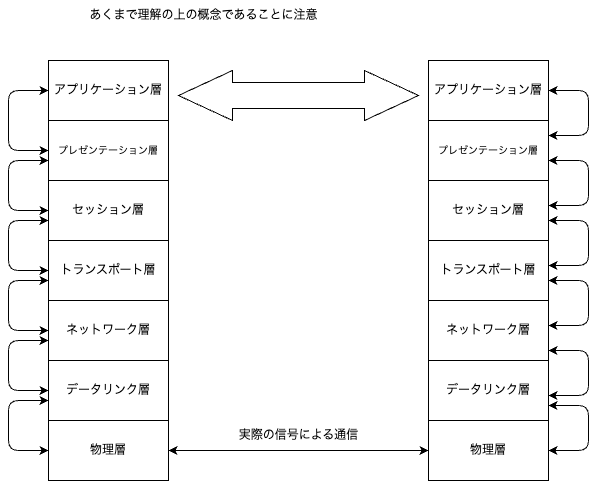

# OSI7階層モデル

私たちが使っているインターネットでは、TCP/IPというものを使っています。

* プロトコル(ネットワークに関する)
    * プロトコルとは
        * ルールのこと
        * ルールを決めておかないと、通信ができない
        * ルールを決めておくことで、通信ができる
        * 例えるならば言語みたいなもの(両者で合意が取れないと意思疎通=通信ができない)
* OSI 7階層モデル
    * OSI(Open Systems Interconnection)は、国際標準化機構(ISO)が定めた、ネットワーク通信のためのプロトコルの階層モデル
    * OSI7階層モデルは、ネットワーク通信を7つの階層に分けて考えることができる
    * OSI7**階層**モデルは、OSI**参照**モデルとも呼ばれる
    * 受け取ったデータを流していく
        * 上位層 → 下位層 へ変換されたデータを流す
        * 下位層 → 上位層 へデータを変換して渡す
        * 互いの同一層では同一のプロトコルで話せているように見える
    * 7つの階層は、上から順に
        * 
        * アプリケーション層
            * 実際に私たちが使っているレベルの話
            * メールやWebのアプリケーションの話しているもの
                * 例: HTTP, FTP, SMTP…
        * プレゼンテーション層
            * データの表現形式を変換する層
            * 例: 文字コードの変換
        * セッション層
            * 通信セッションの管理を行う層
            * 例: セッションの確立、維持、終了
        * トランスポート層
            * データの信頼性を確保する層
            * 例: TCP, UDP
            * TCPはコネクション型、UDPはコネクションレス型
        * ネットワーク層
            * データのルーティングを行う層
            * 例: IP
        * データリンク層
            * 物理的な接続を管理する層
            * 例: MACアドレス
        * 物理層
            * 物理的な接続を行う層
            * 例: ケーブル、無線
        * 隣接する層の間でのデータ交換のみ各層は責任を持つ
            * 例: トランスポート層であれば
                * セッション層からおりてきたデータを変換してネットワーク層へ引き継ぐ
                * ネットワーク層からおりてきたデータを変換してセッション層へ引き継ぐ
            * 他の層の部分は関知しない
                * この考え方により、各層は独立性が高く、可換性が高いといえる
                * 例外: トランスポート層は、データの信頼性を確保するために、ネットワーク層の状態を知る必要がある
        * 同一階層同士では同じプロトコルで話ができている
            * アプリケーション層で考えれば、クライアントとサーバーという形での通信が成立する
                * Webサーバーとブラウザの関係みたいなもの
    