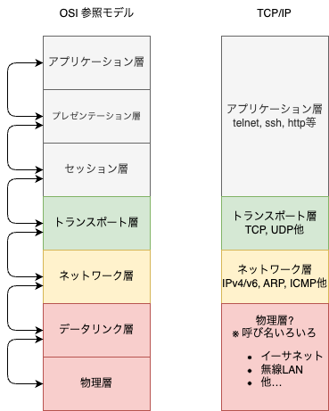

# TCP/IPに軽く触れる

* TCP/IPはOSI7階層モデルに対する実装のひとつと考えておけばよい

大雑把に4つの階層で考えられる
* アプリケーション層
    * OSI7階層モデルのアプリケーション層、プレゼンテーション層、セッション層に相当
    * 実際に私たちが使っているレベルの話
    * メールやWebのアプリケーションの話しているもの
        * 例: HTTP, FTP, SMTP…
* トランスポート層
    * OSI7階層モデルのトランスポート層に相当
    * データの信頼性を確保する層
    * 例: TCP, UDP
    * TCPはコネクション型、UDPはコネクションレス型
* ネットワーク層
    * OSI7階層モデルのネットワーク層に相当
    * データのルーティングを行う層
    * 例: IP
* ネットワークインターフェース層(あまり呼び名が固定されてないので微妙)
    * OSI7階層モデルのデータリンク層、物理層に相当
    * 物理的な接続を管理する層
    * 例: MACアドレス
    * 物理的な接続を行う層
    * 例: ケーブル、無線
* 隣接する層の間でのデータ交換のみ各層は責任を持つ
    * このあたりはOSI参照モデルと同じ

このことから、基本的には『途中のプロトコル実装を交換しても影響が出ない』とされている(実際は細かいところで手入れが必要ですが)。

* 実際、IPv4→IPv6はこの考え方で移行が徐々に進んでいる
