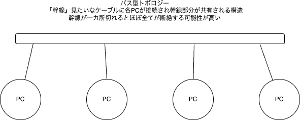
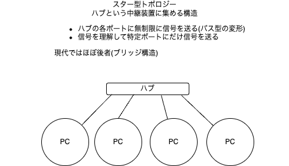
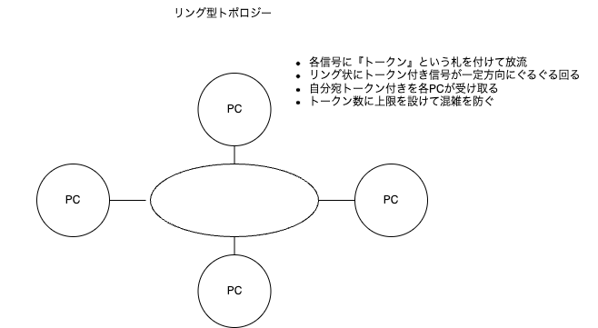
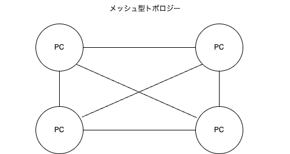

# イーサネット

イーサネットは、一般的に『有線のケーブル』と言われるようなものです。
イーサネットは、LAN(Local Area Network)で使用される通信プロトコルのひとつで、物理層としてのケーブル構造と共に、レイヤー2(データリンク層)の機能にも関わってきます。

なお、イーサネット(ethernet)の『イーサ』部分(ether)は、ギリシャ語の『エーテル』に由来しています。
エーテルは、そこら中に満ちているとされていた物質で、どこででも通信できるようにといった意図がこめられていると考えておくといいでしょう。

## イーサネットの物理特性

イーサネットは、物理層としてのケーブル構造を持ちます。
イーサネットの物理層は、主に以下のようなものがあります。

- Twisted Pair Cable(ツイストペアケーブル)
    - ツイストペアケーブルはその名の通り『ツイスト』(捻れた)かたちで2本のケーブルを組み合わせ(撚り線)たものです
    - この構造にすると、ノイズの影響を受けにくくなるという特性があります(詳しい仕組みは聞くな)
    - 撚り線を4つで8本の線を使った構造になっています(4対8芯)
    - STP（Shielded Twisted Pair）シールド付きツイストペアケーブル  
        企業向けや高品質なネットワーク環境向けに採用され、1970年代後半から普及し始めました。
    - UTP（Unshielded Twisted Pair）シールドなしツイストペアケーブル  
        コスト効率の高さから、1980年代以降、一般的なLAN環境で広く利用されるようになりました。
    - なお、同軸ケーブルは20世紀初頭に登場し、もともとはラジオやテレビの信号伝送に使われ、後にネットワーク通信へと応用されました。
- Coaxial Cable(同軸ケーブル)  
    - 同軸ケーブルは、中心に導体があり、その周りを絶縁体とシールドが覆う構造を持ちます。
    - もともとはテレビやラジオの信号伝送に使われていましたが、後にネットワーク通信にも利用されるようになりました。
    - ただし、イーサネットの普及とともに、ツイストペアケーブルに取って代わられました。

ツイストペアも、同軸ケーブルもネットワーク以前にテレビや電話などの通信分野で使われていた技術をベースとするため、比較的安価に大量に作りやすい状況になっていました。

- Fiber Optic Cable(光ファイバーケーブル)  
    - 光ファイバーケーブルは、光信号を伝送するためのケーブルで、高速通信が可能です。
    - 主に長距離通信や高帯域幅のネットワークに使用されます。

通信技術の進化という側面では『速度の欲しいところは光ファイバーから』という感じでした。

## トポロジー

ネットワークの構成方法については、トポロジー(Topology)と呼ばれる構成方法の概念があります。一般的なものだけを挙げると、以下のものが登場します。

- バス型トポロジー 
    - すべてのデバイスが同じケーブルに接続されている構成です。
    - ケーブルの両端に終端抵抗を設置することで、信号の反射を防ぎます。
    - ただし、ケーブルが切断されると全体が影響を受けるため、耐障害性が低いです。
- スター型トポロジー 
    - すべてのデバイスが中央のスイッチやハブに接続される構成です。
    - ケーブルが切断されても、他のデバイスには影響を与えません。
    - 一般的なLAN環境で広く使用されています。
- リング型トポロジー 
    - すべてのデバイスがリング状に接続されている構成です。
    - 信号がリングを循環するため、耐障害性が高いですが、ケーブルが切断されると全体が影響を受けます。
    - 現在では**あまり一般的ではなくなっており**、まずみることはありません
- メッシュ型トポロジー 
    - すべてのデバイスが相互に接続されている構成です。
    - 耐障害性が非常に高いですが、コストがかかります。
    - 大規模なネットワークや特定の用途で使用されます。
    - いわゆるP2P(Peer to Peer)のようなものです。
    - 物理的にはめったに行われませんが、論理的には行われていることもあります
      - 分散型のファイル転送システムなど(BitTorrentなど)

実際のネットワークでは、スター型トポロジーをバス型で連結して拡大するような『スターバス型』のようなものも存在します。
また、部屋内でスター型を構成し、部屋間をさらにバスやスター型で連結していくことも普通に行われています。

## イーサネットとトポロジー

- 初期のイーサネットではバス型トポロジーが使われていた
    - 10BASE5(同軸ケーブル)
    - 10BASE2(同軸ケーブル)
    - 10BASE-T(ツイストペアケーブル) ※メディア変換器という形でハブを使うことになる
- その後スター型へと変更されていった
    - 100BASE-TX(ツイストペアケーブル)
    - 1000BASE-T(ツイストペアケーブル)
    - 10GBASE-T(ツイストペアケーブル)
    - 10GBASE-SR,LR(光ファイバーケーブル) 他

最近ではここに無線LANによるネットワークの拡張も広く普及している

## カテゴリー

イーサネットでは通信品質を確保するために、ケーブルの種類をカテゴリーで分けています。
現在使われているもので考えると、大きく以下のものが出回っています。

- カテゴリー5e(Cat5e)
    - 1000BASE-Tに対応(100BASE-TXも)
    - 最大伝送速度：1Gbps
    - 最大伝送距離：100m
- カテゴリー6(Cat6)
    - 1000BASE-Tおよび100BASE-TXに対応
    - 最大伝送速度：10Gbps
    - 最大伝送距離：100m、ただし10GBASE-Tは55mまで(37mまでの場合もあり)
- カテゴリー6a(Cat6a)
    - 10GBASE-Tに対応(100BASE-TXも)
    - 最大伝送速度：10Gbps
    - 最大伝送距離：100m
- カテゴリー7(Cat7)
    - 10GBASE-Tに対応(100BASE-TXも)
    - 最大伝送速度：10Gbps
    - 最大伝送距離：100m

なお、規格名の後に出るTやTX等はケーブル構造を示すものになっています。
- T:ツイストペアケーブル(半二重通信が主)
- TX:全二重に対応したもの
- S: 光ファイバーのショート(短距離)
- L:光ファイバーのロング(長距離)
- C: 同軸ケーブル

ただし、1000BASEはTXではなくTになっています。実際の通信が半二重というわけではなく、全二重通信(送受信が並行して行える)です。
信号線上を交差しても大丈夫な処理を加えることにより実現しています。

## おまけ: イーサネット規格

| 規格名         | 速度    | ケーブル種別                                      | 理論上の伝送距離  |
|----------------|---------|--------------------------------------------------|-------------------|
| 10BASE-5       | 10Mbps  | 同軸ケーブル(Thick Ethernet)                   | 約500m            |
| 10BASE-2       | 10Mbps  | 同軸ケーブル(Thin Ethernet)                    | 約185m            |
| 10BASE-T       | 10Mbps  | ツイストペアケーブル                             | 100m              |
| 100BASE-TX     | 100Mbps | ツイストペアケーブル                             | 100m              |
| 1000BASE-T     | 1Gbps   | ツイストペアケーブル                             | 100m              |
| 10GBASE-T      | 10Gbps  | ツイストペアケーブル (Cat6a推奨)                   | 100m              |
| 10GBASE-SR     | 10Gbps  | MMF(マルチモードファイバー)                    | 300m              |
| 10GBASE-LR     | 10Gbps  | SMF(シングルモードファイバー)                   | 10km              |
| 10GBASE-ER     | 10Gbps  | SMF(シングルモードファイバー)                   | 40km              |
| 40GBASE-LR4    | 40Gbps  | SMF(シングルモードファイバー)                   | 10km              |
| 40GBASE-ER4    | 40Gbps  | SMF(シングルモードファイバー)                   | 40km              |
| 100GBASE-LR4   | 100Gbps | SMF(シングルモードファイバー)                   | 10km              |
