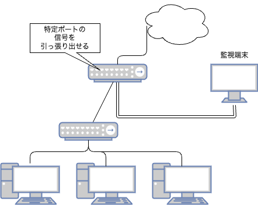

# スイッチ(switch)

```{tip}
もちろん某社のゲーム機ではありません
```

スイッチは、データリンク層でMACアドレスを用いてイーサネットフレームを転送する装置であり、データリンク層の理解において重要な機器です。

## スイッチとハブ

スイッチは、複数のポートを持ち、各ポートに接続されたデバイス同士を接続するための機器です。
スイッチは、MACアドレスを利用して、データを適切なポートに転送します。

なお、同様のもので、ハブがありますが、こちらは物理層(レイヤー1)に関わる装置で、10BASE-T時代に使われていたものとして区別されます。

- ハブ(レイヤー1)
    - 物理層の装置
    - 受信したデータ(電気信号)を増幅して、残りのポートに送信する
- スイッチ(レイヤー2)
    - データリンク層の装置
    - 受信したデータをMACアドレスを元に、適切なポートに転送する
    - ユニキャストであれば1つのポートに、マルチキャスト(ブロードキャスト)は複数ポートに転送する

```{note}
一般的にはスイッチも含めて広義に『ハブ』と表現されることがあるため、レイヤー2で動作するスイッチを明確に指す場合は**スイッチングハブ**と呼んで区別することがあります。

また、ハブ(L1)に関しては、ほぼ何も考えずに他ポートに転送することから**バカハブ**と揶揄されることがあります。
もちろんこれは俗語であり、公式な場での使用は避けるべき表現ですが、ネットワーク関連の業務では案外通じることがあります。
```

## スイッチの構造

スイッチは構造上、CPUやメモリを積んだミニコンピューターの様相となります。

- 各ポートから電気信号として対向からのデータを受信します
- 受信したデータを『一度デジタル信号(0と1)に復号化』します
- データをCPUで解析します
- データの先頭には『フレームヘッダ』という構造が含まれています
  - MACアドレスやプロトコルの情報が含まれています

イーサネットのレベル(データリンクのレベル)では、ひとかたまりのデータ構造を『フレーム』と称しています。

- フレームをひととおり取得して、イーサネットヘッダと呼ばれる構造を取得します
- イーサネットヘッダに含まれるMACアドレスを使って『このデータをどのMACアドレスに送るか』を決定します
- そのMACアドレスが繋がっている(と判定されている)ポートへデータを送出します

## どのポートに送ればいいのか?

イーサネットヘッダから宛先MACアドレスを抽出して転送先ポートを決定すると述べましたが、スイッチはMACアドレスとポートの対応関係をどのように学習・保持しているのでしょうか？

- スイッチは内蔵メモリに、受信したフレームの送信元MACアドレスとポート番号を学習・記憶します。
  この対応表（MACアドレステーブル）を参照して転送先ポートを決定します。
- **MACアドレステーブル**
  - 学習したMACアドレスとポート番号の対応表  
  - 次回以降のデータ転送を高速化- 無い場合はどうするのか
    - ブロードキャストフレームを生成して全ポートに送信する
    - 発生率は低い
- ブロードキャストフレーム
    - 宛先MACアドレスがFF:FF:FF:FF:FF:FF
    - すべてのMACアドレスに送信することを意味する
    - 必要とする所があれば、送信元MACアドレスに対して返信フレームを発行するだろう
        - ARPプロトコルがこれに該当する

次のようなMACアドレステーブルの例を示します:

| MACアドレス         | ポート番号 |
|:-------------------|:---------:|
| 00:11:22:33:44:55 |     1     |
| AA:BB:CC:DD:EE:FF |     2     |
| 12:34:56:78:9A:BC |     3     |

## スイッチはどこまで処理するのか?

スイッチの性能は、搭載されているCPUやメモリに大きく左右されます。

- CPUの性能の及ぼす影響
    - 電気信号からの復号化、ビット列を電気信号に変換する速度に影響する
    - 処理が早ければメモリを空けるのも早くなる
- メモリの及ぼす影響
    - MACアドレスのテーブル容量(大きければ大きいほど記憶できる)
    - 未解析のフレームのバッファリングがしやすくなる
        - これにより、一時的なトラフィックの集中（マイクロバーストなど）に対応できます。
        - しかし、処理能力を超えるトラフィックが継続するとバッファが溢れ、フレームは破棄されます。

よって、高性能なものはCPUやメモリの性能・容量が高くなり、その分**価格に反映される**ことになります。
逆も然りです。

また、フレームの転送処理方式には、主に以下の2つがあります。

- ストアアンドフォワード方式(Store and Forward)
    - 受信したフレームを一度メモリに格納してから、解析を行う
    - メモリに格納することで、フレームの整合性を確認できる
    - 整合性が確認できたら、ポートに転送する
    - 整合性が確認できなかった場合は、フレームを破棄する
    - 遅延が生じやすい(全てを読み込んで解析をする必要があるため)
- カットスルー方式(Cut Through)
    - 受信したフレームを全てメモリに入れる前にフレームヘッダ部分のみで解析を行ってしまう
    - 遅延が非常に小さいが、エラーがあってもそのまま転送する可能性

以前は低遅延が重視される環境でカットスルー方式が採用されていましたが、近年のスイッチは性能が向上したため、信頼性の高いストアアンドフォワード方式が主流となっています。

- 一例: [Buffaloのスイッチの仕様](https://arc.net/l/quote/ishchzbi)部分

## ちょっと変わったスイッチ達

個人向けのものではない企業(法人)向けのものだと、値段が当然上がりますが少し変わった(?)機能が付加されることがあります。

```{note}
もともと法人向け製品は、耐久性、高可用性、性能面で個人向け製品よりも優れたものを提供することが一般的です。
そのため価格は当然個人向けより高いです。
ただし、管理が不要な小規模なネットワークでは、企業内でも個人向けのスイッチが利用されることもあります。
```

### ポートミラーリング



- 特定のポートで送受信されるトラフィックを、指定した別のポートにコピー（ミラーリング）する機能です
- これにより、ネットワークアナライザなどを接続してトラフィックを監視・分析できます

リピータハブ(通称バカハブ)は受信した信号を全ポートに転送するため、トラフィック監視が容易でしたが、スイッチングハブでは宛先ポートにしか転送されません。 
そのため、スイッチングハブ環境でトラフィック監視や監査を行う際に、このポートミラーリング機能が利用されます。

もともとはバカハブ(区別のため敢えて呼称)が全ポート飛ばせていたので役立っていました。

### VLAN(Virtual LAN)


- 1台の物理的なスイッチ内に、複数の論理的なLAN（ネットワークセグメント）を構築する技術です
- VLANごとにブロードキャストドメインが分割されるため、不要なトラフィックの拡散を防ぎ、セキュリティを向上させることができます

例えば、1台のスイッチに5台のホストが接続されている場合に、VLANを利用して特定の3台と残りの2台を異なるネットワークセグメントに分離できます。

- VLAN1
    - ホストA
    - ホストB
    - ホストC
- VLAN2
    - ホストD
    - ホストE

このように分けることで、ホストA,B,CはD,Eのブロードキャストフレームを受信しなくなります。

実装方式としては大きく2つが考えられます。

- ポート単位
    - 事前にポートごとにVLANを切り分ける方式
    - 例えば、ポート1,2,3をVLAN1、ポート4,5をVLAN2とする
- タグ付け方式
    - 受信したフレームにVLANの情報を付加して、ポートを分ける方式
    - 例えば、ポート1,2,3はVLAN1、ポート4,5はVLAN2とする
    - タグ付け方式は、IEEE802.1Qという規格に基づいています
    - タグ付け方式は、ポート単位よりも柔軟性がありますが、スイッチの性能に影響を与えることがあります

もちろんミックスも可能な場合があり、それぞれの機能を組み合わせることもあります。

例えば8ポートありますという場合に、以下のように設計したとします。

- ポート1-7はタグ付きVLANで設計
- ポート8は別VLANとなるポートに設定

こうすることで、ポート8はポート1-7のVLANに参加しないことになります。
その下にハブや無線APをぶら下げることで、ゲスト用に設定するといったことが可能になります。

```{note}
タグVLANを使用するポート(トランクポート)では、特定のVLAN IDのフレームに対してはVLANタグを付加せずに送受信する設定ができます。
このようなタグを付与しないVLANを『**ネイティブVLAN**』と呼びます。 
これは、例えば管理用のVLANや、VLAN非対応の機器を接続する場合などに利用されます。
```

### L2 スイッチ

VLANやポートミラーリングなど、基本的なフレーム転送機能(MACアドレス学習とフォワーディング)に加えて、上記のような高度な機能を持つスイッチは、L2スイッチ(レイヤ2スイッチ)と呼ばれることがあります。これは主に機能面での区別や製品カテゴリとして用いられる用語で、ネットワーク設計の際に考慮されます。

