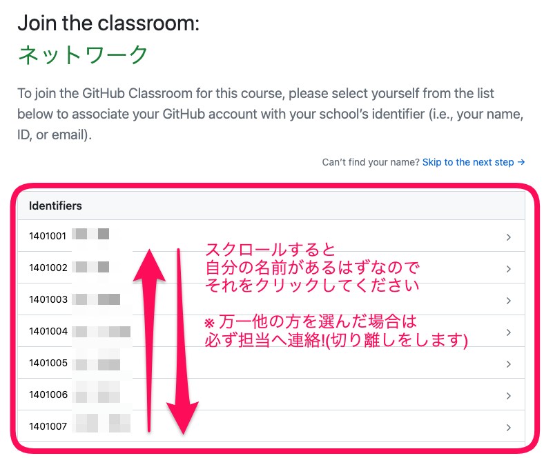
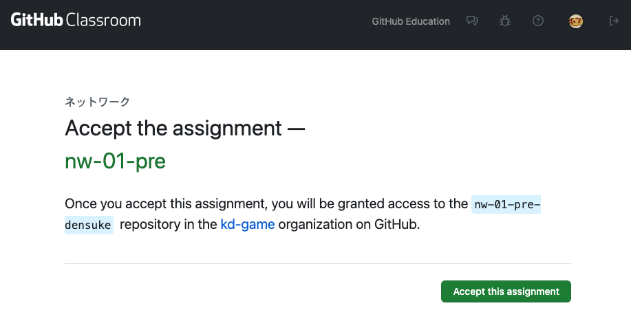
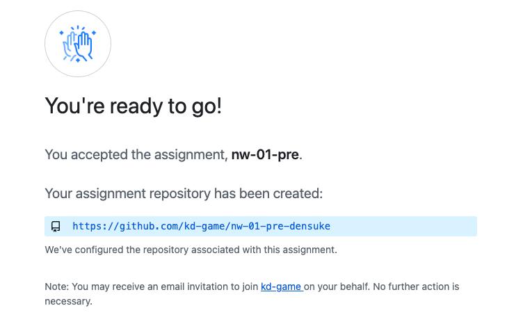
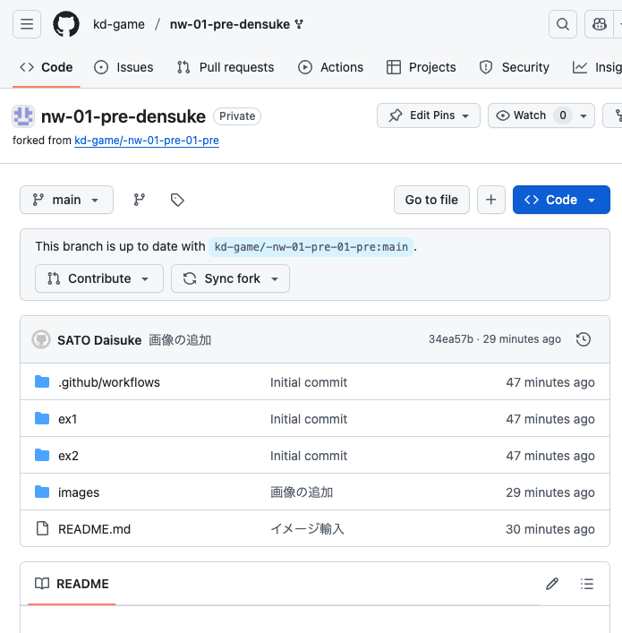
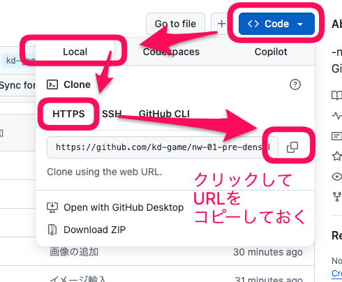

# 課題の割り当てを受ける

授業内で課題のURLが提示されます。今回は練習用ということで、以下のものを使って下さい。

- [練習用課題](https://classroom.github.com/a/F29_mTWP)

```{warning}
この課題に関しては、動作チェックを兼ねるためのものとして、期限を設定していません。
ただし期末評価の際にチェックを行うので、必ず提出しておいてください。

以降の科目は適宜**2週間を目安に期限**を決め、それ以降の評価は原則行いません
```

初めて入る場合、誰かということで選択が出ます。


次に課題の受け取り確認が出るので、緑のボタンで進めます。


少し待つと、assignが完了し、あなた用のリポジトリが生成されます。


作成されたリポジトリURLをクリックすることで、問題のページへ移動できます。


リポジトリのURLは、codeボタンから取得できます。
