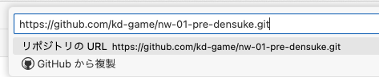
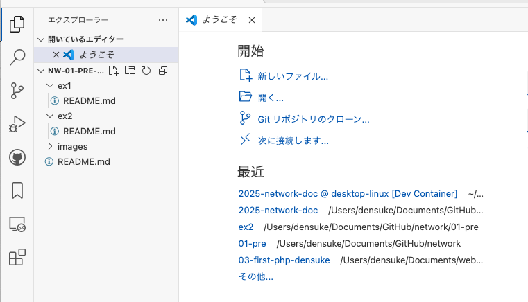

# コードの取得(Clone)

ではコードの取得です。
VS codeをリモート(network)に繋いだ上で、コマンドパレットからのコマンド "Git: Clone" を呼び出します。
ここで先程コピーしているURLをペーストしてください。

クローン先ディレクトリの場所を問われますが、そのまま(ホームディレクトリ上)でかまいません。

クローンすると、どうするかを問われますが、現在のウィンドウでも新規ウィンドウでもかまいません。
ファイル一覧にex1,ex2等のディレクトリ名が出る状態ならOKです。

