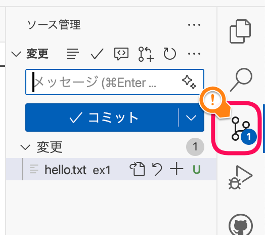
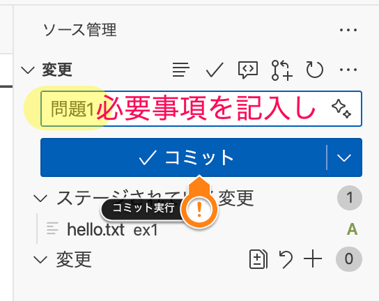
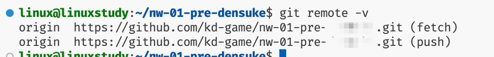

# 問題1対応について

問題1を使って、基本の流れを確認していきます。

## READMEを読もう

各問題のディレクトリには、何をするかを示すための`README`を配置しています。

```{note}
「READ ME -> 私を読んで! 」ということで、まずこれを読もうというIT業界でのお約束です。
```

```markdown
# 問題1 提出の練習

このディレクトリ上に、以下の仕様でファイルを作り、GitHubに送信してみましょう。

## ファイルの仕様

- ファイル名: `hello.txt`
- 内容: `Hello World!`
- 改行: あっても無くてもOK
- 文字コード: UTF-8

## 提出方法

1. 指定のファイルを作成する
2. コミットする
3. プッシュする

完了後、リポジトリのURLを開くことで、ファイルが配置されているかが確認できます。
```

## ファイルを作る

ということで、実際にファイルを作ってみましょう。

1. ex1ディレクトリで右クリックをし、新規ファイルの作成を指示、ファイル名を`hello.txt`とします
2. (おそらく)自動的に`hello.txt`が開くので、内容を`Hello World!`とします
3. 保存を忘れずにしておきましょう(ショートカット {kbd}`Ctrl+S` macOSの方は {kbd}`Cmd+S` )

```{note}
たまにバッククォート記号を付けて記入する方もいますが、それは残念ですが違います。
バッククォートはMarkdownのマークアップで用いられる「コードを囲む」ための記法です。
よって記入不要となります。


```

## ステージに上げる

保存したら、「ソース管理」のアイコンをクリックし、ソース管理のパネルを開きます。


変更されたファイルが一覧されており、そこに`hello.txt`もリストアップされていると思います。

```{note}
されてない?

- 保存しましたか?
- リロード(円形矢印)で反映できませんか?
```

`hello.txt`にカーソルを乗せると右側にアイコンが出ます。この中の`+`をクリックしてください。

この操作で「ステージ」という領域にあげられます。

```{note}
「ステージ」とは、次に「コミット」するときに対象とするための領域です。

このgitという環境では、まとまった変更を「コミット」という単位で管理しています。
そのため次のコミットに含めるものを選んで登録する必要があります。

「もうめんどい」という方は、「変更」の部分で`+`をクリックすればひとまとめにステージに上げられます。
```

```{note}
逆に今回のコミットに含めたくないものであれば、`-`でステージから下ろすこともできます。
```

## コミットして送信(push)

ステージに必要なファイルを上げたところで、コミットを実行します。

1. コミットメッセージを記入します
2. コミットボタンを押します



```{warning}
メッセージを書かずにコミットボタンを押すと、エディタが開いてコミットの理由を記入するようになります。
1行目に同様に記入し、保存。その後閉じればコミットが継続されます。
```

コミット完了後、ボタンがプッシュに切り替わりますので、送信してください。

```{note}
コミットすべきものがまだある場合は、プッシュ用のボタンに切り替わりません。
その際は画面下部にあるアイコンからでも対応可能です。
```

## 提出後の確認(任意)

プッシュ(push)操作が完了していれば、GitHub(Classroom)側にコミット結果が送付された形になっています。
もし気になる方は、リポジトリを見てみるといいでしょう(慣れるとそれほど見に行かなくなりますが)。

なお、リポジトリのアドレスがわからなくなるという方もいると思いますので、いくつか発見ルートを紹介します。

- 課題のリンクをGoogle Classroomで見つけて移動する
  - 各自の課題リポジトリに移動できます
- GitHubのトップページから、`Your repositories`を選択
- `git`コマンドを使って確認する
  - vscode(リモート接続中)のターミナルにて {command}`git remote -v` でリモートのURLを確認する
  - 

リポジトリ上で、ファイル名のところを探すと、最後のコミットメッセージでわかると思います。
