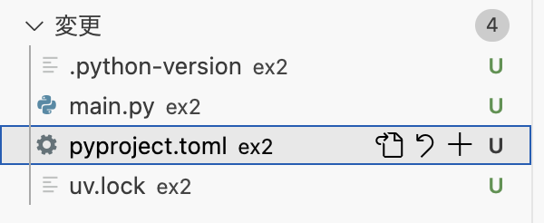
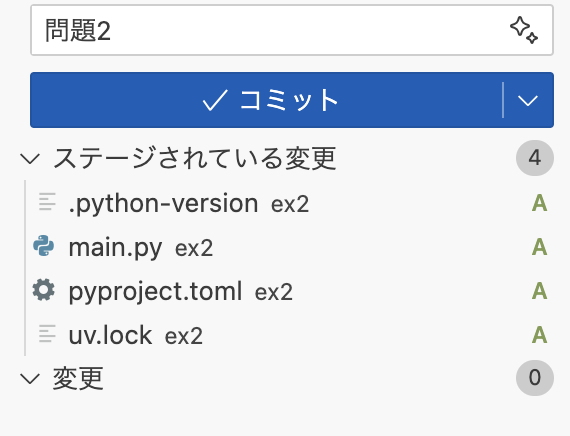

# 問題2を考えてみる

問題2は、今後登場することのあるスタイルで、プログラムを作成するものになります。
今回の問題は、以前試した`uv`コマンドを用いたものです。

```markdown
# 問題2

Pythonのuvツールを用いて、スクリプトを作成せよ。

## 仕様

以下を満たすコードを作成すること。

1. uvにてpythonバージョン3.12(の最新版)を利用すること
2. main.pyを作成すること(uv初期化の段階で自動作成されているはず)
3. main.pyを実行すると、**17の31乗(17^31)と31の17乗(31^17)の和**の値を出力すること

```

## 作ってみる

````{note}
`uv`コマンドが入っていない場合、ここから後の作業が進みません。

```bash
# vscodeのターミナル上で実行
$ which uv
```
を実行し、`uv`コマンドのパス(`/home/linux/.local/bin/uv`など)が表示されない場合は入っていませんので、
以下のコマンドを実行し、一度ターミナルを閉じて再度開いてもう一度確認してください。
```bash
$ setup-uv
$ exit # ここで一度ターミナルが閉じるので、再度開く

$ which uv
```
````

プロジェクトは`ex2`ディレクトリ上で作成する必要があるので、ターミナル(リポジトリのトップで起動している)上で一度`cd`してから進めましょう。

```bash
$ cd ex2
$ uv init --python=3.12
```

ここで`uv`に付けた`--python=3.12`は、Pythonの最低バージョンを指定するものと考えてください(3.12以上でのコードとなる)。
仮に付け忘れたとしても、`pyproject.tomo`にて確認して編集可能です。

```toml
[project]
name = "ex2"
version = "0.1.0"
description = "Add your description here"
readme = "README.md"
requires-python = ">=3.13" # ここを変更すればよい(3.13 → 3.12)
dependencies = []
```

そして、`main.py`が存在しているはずなので、必要なコードにしてみます。

```{code-block}
:language: python
:linenos: true
:emphasize-lines: 2
:caption: ex2/main.py

def main():
    print(17**31 + 31**17)


if __name__ == "__main__":
    main()

```

## テスト

コードは動いてなんぼです。
実際に実行してみましょう。

### Pythonのバージョン確認

今回はuvで実行環境の仮想化をしてバージョンを規定しています。
正しい指定バージョンであるかを確認しておきましょう。
仮想環境でのコマンド実行は `uv run` で行えます。

```bash
$ cd ex2 # ex2ディレクトリにいなければ移動しておく
$ uv run python -V

Using CPython 3.13.3
Creating virtual environment at: .venv
Python 3.13.3
```

あらら、このケースでは3.13.3が動いてしまいました。Pythonのバージョンが指定のものではないということですので、切り替えます。
`uv`においてこの操作は「Pythonバージョンのピン留め」となります。

```bash
# ex2にいることを前提とします
$ uv python pin 3.13
warning: No interpreter found for Python 3.12 in managed installations or search path
Updated `.python-version` from `3.13` -> `3.12`

$ uv run python -V

Using CPython 3.12.10
Removed virtual environment at: .venv
Creating virtual environment at: .venv
Python 3.12.10
```

この操作により、既に作られていた3.13ベースの仮想環境(`.venv`)が削除され、3.12ベースで再作成と実行という流れとなりました。

### コードの実行

`uv run`は実行するスクリプトを直接渡せます。

```bash
$ uv run main.py
1392XXXXXXXXXXXXXXXXXXXXXXXXXXXXXXX3344 # 結果は自分で確認しよう
```

動くことが確認できました。
あとはコミットしてみましょう。

## コミットとプッシュ

この時点で「ソース管理」では複数のファイルがリストアップされているはずです。



- `main.py`: スクリプト本体
- `pyproject.toml`: プロジェクトの設定ファイル(自動生成、人によっては一部書き換え)
- `uv.lock`: uvによる仮想環境の設定ファイル(自動生成)
- `.python-version`: uvによるPythonバージョンの設定ファイル(自動生成)

```{note}
これ以外に `.venv` というディレクトリが存在しますが、git管理対象外です。
```

ということで、この4つのファイルを「追加」してコミットしましょう。「問題2」とでもしておきましょうか。



コミットが完了したら、問題1同様にプッシュ操作まではしておきましょう。

