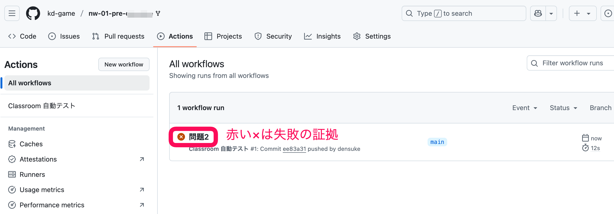

# 評価

提出したコードが仕様を満たすかどうかは、自動テストを通じて確認されています。

自分のリポジトリにある {menuselection}`Actions` を使ってみて下さい。



残念ながらテストが失敗しています。
クリックして詳細を出してみましょう。
失敗したテストを選んでみると、失敗したところに移動します。


test2-1,test2-2は成功しているようですが、test1が失敗しているようですね。
それっぽいテストの部分を戻って選択してみましょう。


```
Run classroom-resources/autograding-io-grader@v1
  with:
    test-name: test1
    command: cat ex1/hello.txt
    expected-output: Hello World!
    comparison-method: exact
    max-score: 1
    timeout: 10
cat: ex1/hello.txt: No such file or directory
```
あら、 `ex1/hello.txt`が見つからなかったようです。
問題2に注力して、問題1の提出を忘れていたようです。

コミットして再提出後、再度`Actions`を確認してみます。

問題1の評価を展開してみるとこうなりました。
```{code-block}

Run classroom-resources/autograding-io-grader@v1
  with:
    test-name: test1
    command: cat ex1/hello.txt
    expected-output: Hello World! # 想定した出力
    comparison-method: exact
    max-score: 1
    timeout: 10
{
  version: 1,
  status: 'fail',
  max_score: 1,
  tests: [
    {
      name: 'test1',
      status: 'fail',
      message: 'Output does not match expected: Hello World! Got: Hello World', #???
      test_code: 'cat ex1/hello.txt <stdin>',
      filename: '',
      line_no: 0,
      execution_time: '0.004s',
      score: 0
    }
  ]
}
```

どうやら予期していた(expected)出力と異なっているようですね。
`Hello World!`と`Hello World`の違いです。
`!`が抜けているようです。

ということで修正して再度コミットして再提出してみましょう。

結果、無事に課題は全て通過できました。

```
Test runner summary
┌────────────────────┬─────────────┬─────────────┐
│ Test Runner Name   │ Test Score  │ Max Score   │
├────────────────────┼─────────────┼─────────────┤
│ test1              │ 1           │ 1           │
├────────────────────┼─────────────┼─────────────┤
│ test2-1            │ 1           │ 1           │
├────────────────────┼─────────────┼─────────────┤
│ test2-2            │ 1           │ 1           │
├────────────────────┼─────────────┼─────────────┤
│ Total:             │ 3           │ 3           │
└────────────────────┴─────────────┴─────────────┘
🏆 Grand total tests passed: 3/3
```
